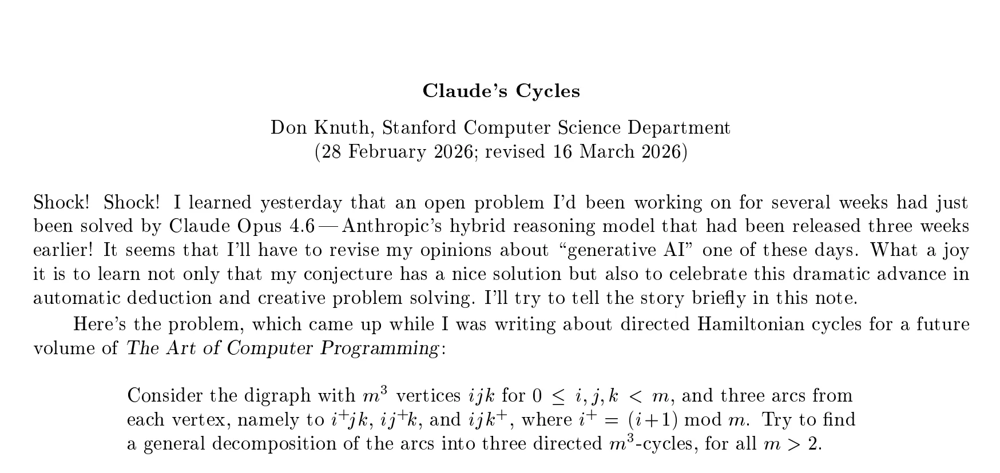
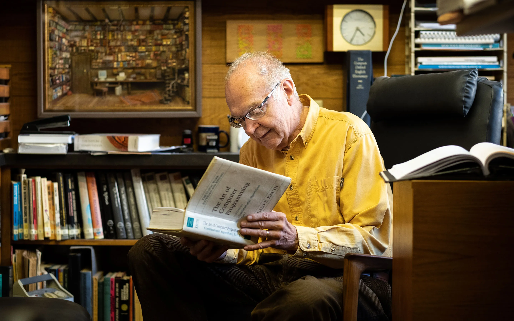

# Shock! Shock! 88岁计算机科学教父震惊：AI解出了困扰他数周的数学难题

2026 年 2 月 28 日，88 岁的 Donald Knuth（高德納）——这位被誉为“计算机科学教父”的传奇人物，发表了一篇名为《Claude's Cycles》的论文。开篇第一句话就是：

> Shock! Shock! I learned yesterday that an open problem I’d been working on for several weeks had just been solved by Claude Opus 4.6 ...

（“卧槽！一个我已经研究了数周的未解问题，昨天竟然被 Claude Opus 4.6 解决了……”）

在计算机科学领域，Donald Knuth 的地位无人能及。

* 自 1962 年起撰写被誉为**计算机科学领域“圣经”的《计算机程序设计艺术》**（_The Art of Computer Programming_），这套巨著至今仍在持续更新。只要发现书中的错误，就可以获得 2.56 美元的奖励支票
- 发明了 **TeX 排版系统**——几乎所有学术论文的排版都建立在他的创造之上
- 1974 年获得图灵奖
- ……

关于《计算机程序设计艺术》这本书，说点题外话。比尔·盖茨曾说过：“如果你能把这本书全部读完，就把简历寄给我吧。”而苏运霖老师在翻译这本书的过程中，可谓困难重重，他曾回忆道：……说我们又在搞崇洋媚外的一套，说我们宣扬西方的文明，宣扬西方的生活方式，不知怎么回事，当时竟传出，这本书是宣扬资产阶级生活方式的……

对于一位以严谨著称、向来对 AI 持谨慎态度的学者来说，这种表达方式极为罕见。**AI 到底说了什么，让 Knuth 如此兴奋**？

先来看看 Knuth 提出的数学问题。

想象一个三维的立方体网格，就像魔方一样。在这个长、宽、高均为 `m` 个单位网格中：
- 每个小方块都有 **3 条单向的路径**连接到“相邻”的方块
- 找到一种方法，把所有这些路径**分解成 3 条互不重叠的循环路线**
- 每条循环路线都要穿过所有方块，且每个方块只能经过一次

这个问题叫“图的哈密顿分解”，是组合数学中的经典难题。Knuth 计划将这个问题收录在他下一部著作中，但**数周时间里他都没能找到通用的解法**。

Knuth 的朋友 Filip Stappers 听说了这个问题后，决定尝试一个大胆的实验：**把问题交给 AI 解决**。他使用的是 Anthropic 公司开发的大语言模型 Claude Opus 4.6。

AI 在约 1 个半小时内，经历了类似人类研究者的探索路径：首先通过编写程序进行暴力穷举，在小规模问题上取得成功，但无法推广到一般情况；随后转向寻找规律，提出“蛇形路径”等结构化思路，但未能彻底解决问题。

在多次尝试受阻后，AI 主动调整策略，将问题抽象并重新表述为群论中的“凯莱图”问题，展现出一定的跨领域建模能力。最终，AI 发现了一种基于数学表达式的通用构造方法，能够适用于所有奇数情况。经验证，该方法在所有不超过 101 的奇数测试中均正确通过。

面对 AI 的成果，Knuth 的态度先是一惊，在论文开头连续写下两遍"Shock!"，并表示 *It seems that I’ll have to revise my opinions about “generative AI” one of these days.*（我不得不修正我对生成式 AI 的看法了）。这对于一位从 1990 年代中期就不再使用电子邮件、对新生事物持谨慎态度的学者来说，是一个重大转变。

虽然 AI 找到了解法，但它**无法提供严格的数学证明**。最终的证明工作，仍然由 Knuth 本人完成。

这个案例展示了一种理想的协作方式：由 AI 快速探索大量可能性，发现模式和构造方法，再由人类严格的逻辑证明，深层次的理解和验证。

AI 不是要"取代"人类计算机科学家，而是成为他们的"研究助手"。
