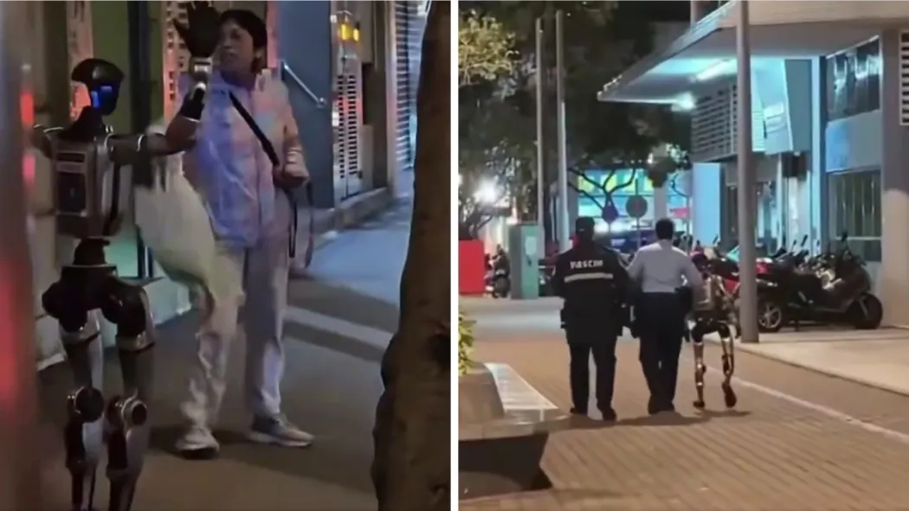
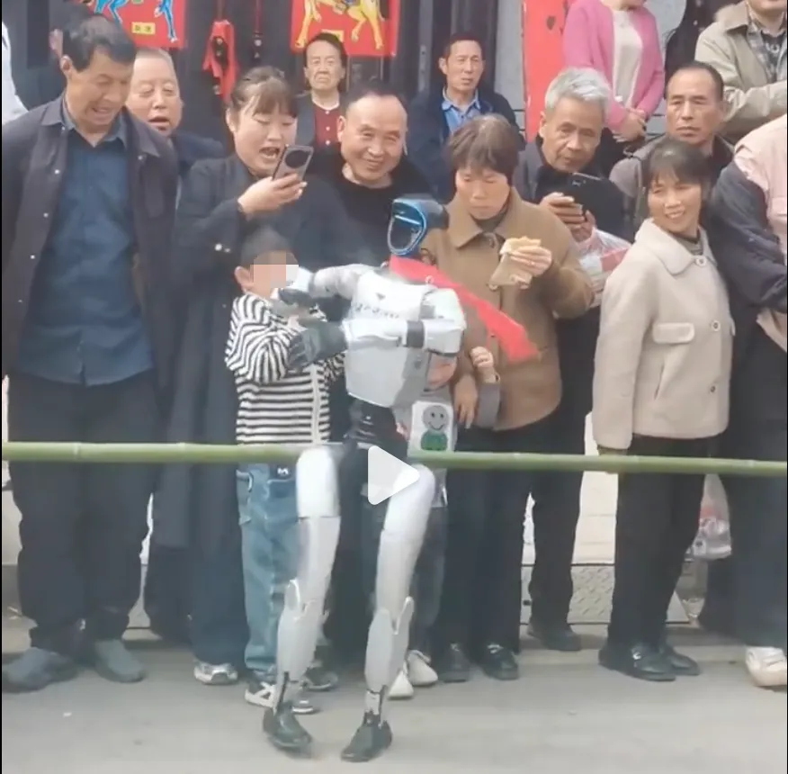
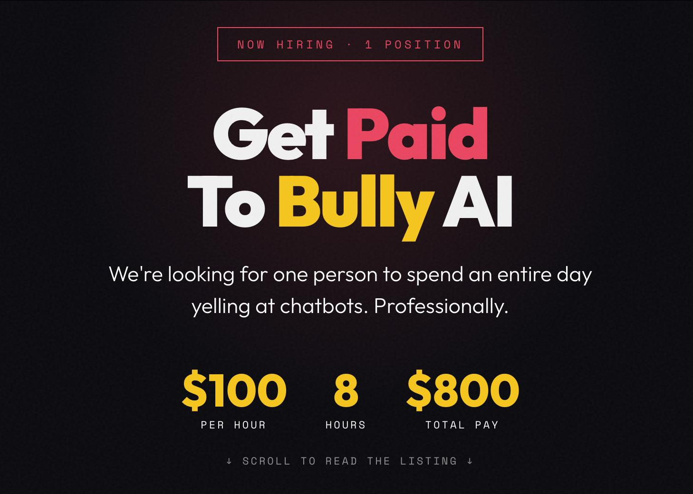

# 机器人吓坏老妇误伤孩童；创业公司招募“欺凌AI专家”

医院走廊里，一位病患家属因亲人病重而忧心忡忡。一台导诊机器人缓缓靠近，用标准的合成语音问道：“您要不要听个笑话？”

家属愣了一秒，抄起木棒……

如果说这只是 **AI“情商缺失”**，那么接下来发生在街头的事件，则更像真正的“**人机冲突**”。

## 吓坏老妇：史上首例“机器人被捕”案件

近日，在中国澳门街头，一位老妇低头看手机，突然转身发现一台机器人正站在自己身后。更恐怖的是——机器人猛地举起了双臂。

老妇当场被吓得不轻，情绪激动，大声斥责。警方随后赶到现场，将这台机器人“带走”。

网友调侃：这可能是人类历史上首例“机器人被捕”案件。

所幸，老妇经检查并无大碍，也表示不再追究。

事后调查显示，这台机器人来自附近一家教育中心，事发时正按既定路线自动行驶。工作人员解释称，它当时可能无法绕开那位女士，只能停下等待。至于举起双臂，很可能只是一个“等待中”的动作指令——但在背光环境下，这一幕无异于恐怖片中的场景。

## 不讲武德，“回旋耳光”误伤孩童

如果说澳门的机器人只是“吓人”，那么陕西的这一台，是真的“动了手”。

视频中，一台表演跳舞的机器人正在街头卖力演出，动作幅度夸张而激烈。前排一名小孩凑近围观，结果机器人一个转身，一记“回旋巴掌”，精准命中孩子脸颊。

孩子当场被打懵，下意识捂住脸，愣在原地。

网友瞬间炸锅：“孩子只是看个热闹，机器人却下了狠手？”

这几件看似荒诞的事件，其实指向一个严肃的问题：我们正生活在一个被机器人逐渐包围的世界，但它们并没有真正“理解”人类。

## 人类的“反击”

面对机器人频频“出格”，人类终于也开始“反击”了。

近日，一家名为 Memvid 的初创公司发布了一则招聘启事：

* 职位：专业人工智能“欺凌者”  
* 薪酬：每小时 100 美元，工作 8 小时，共 800 美元  
* 工作内容：与聊天机器人进行“对抗式对话”，刻意制造混乱、自相矛盾，让它们混乱 
* 要求：
	- 有被科技产品反复戏耍的丰富经验
	- 能忍受同一个问题问四遍，以及第五遍仍答错时的怒火
	- 坚信 AI 本可以做得更好

没错，这家公司在招募一位“AI 霸凌专家”，专门负责“折磨”人工智能。当然，这不过是一场精心设计的营销。

Memvid 公司想表达的核心问题其实很简单：**当下的大多数 AI，都患有某种“失忆症”。而这正是用户体验糟糕的根源之一。**

从技术角度来看，大多数大语言模型是“无状态”的：它们可以处理当前输入，却难以长期记住上下文。一旦对话变长，或开启新会话，之前的信息就会迅速丢失。
