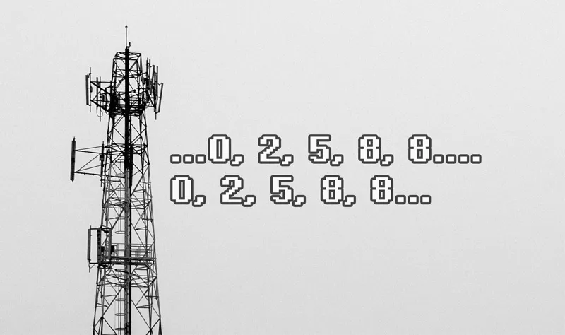
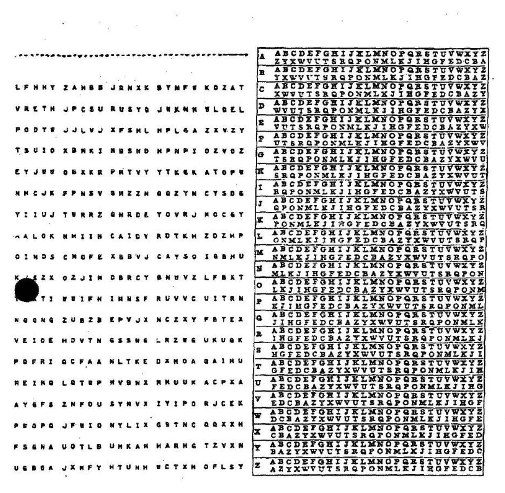

# 伊朗战争期间，一个神秘的波斯语数字电台开始广播了

“Tavajoh! Tavajoh!”——波斯语的“注意！”——一个男人的声音在广播中响起。紧接着，他缓慢而有节奏地念出了一串串毫无规律的数字。

根据 Priyom（一个长期追踪神秘电台的国际无线电爱好者组织）的记录，这个信号首次播出时，正值美国开始对伊朗实施空袭。此后，这段广播固定在世界协调时的 02:00 和 18:00，于 **7910 kHz 的短波频率**上播出，后又转移至 7842 kHz。频率的变化，应该是为了规避无线电干扰。

🎵

Priyom 通过多点监听与三角测向技术，将信号来源锁定在德国的一处军事基地附近。这一结果显著缩小了范围，却并未给出背后的真相。是谁在发送信息，发送给谁，至今仍无从确认。

从技术特征来看，这种广播与**冷战时期**广泛存在的一种通信形式高度一致——**数字电台**（numbers station）。这种系统通过短波频段播放一串串听似随机的数字或代码，以此来传递经过加密的信息。正如相关研究者所指出的，这类广播通常服务于情报机构，是复杂情报行动中的一环。

数字电台的历史可以追溯至第一次世界大战，但其真正的高峰出现在美苏冷战时期。随着间谍活动日益复杂，各国开始采用自动语音系统，将编码后的数字通过短波发送给分布在全球各地的特工。

这些数字背后采用了一种极其**简单却极为严密的加密方法**——**一次性密码本**。在这种体系中，发送方与接收方事先持有相同的一组随机密钥，每条信息使用独立密钥进行加密，使用后立即销毁。任何第三方即便完整截获全部内容，只要缺乏对应密钥，这些数字就始终只是毫无意义的序列。这种加密方式在理论上被认为是不可破解的。

在当代通信技术高度发达的背景下，数字电台显得低效而笨拙。它依赖人工记录，传输速度缓慢，操作复杂，更像是一种“万不得已的通信方式”。但当互联网受到封锁、卫星通信受到干扰、基础设施遭到破坏时，那些高度依赖网络的现代通信方式反而变得脆弱。相比之下，短波广播不依赖任何复杂体系，可以跨越长距离传播，只需一台接收设备即可监听，其匿名性与抗干扰能力反而成为优势。

围绕这一神秘广播，目前存在多种解释。一种观点认为，这是伊朗方面在常规通信受限情况下采取的替代方案，用以维持与外部人员的联系。另一种观点则认为，信号源的定位结果指向欧洲军事设施，其目的可能并非通信本身，而是干扰、误导，甚至作为心理战的一部分。
