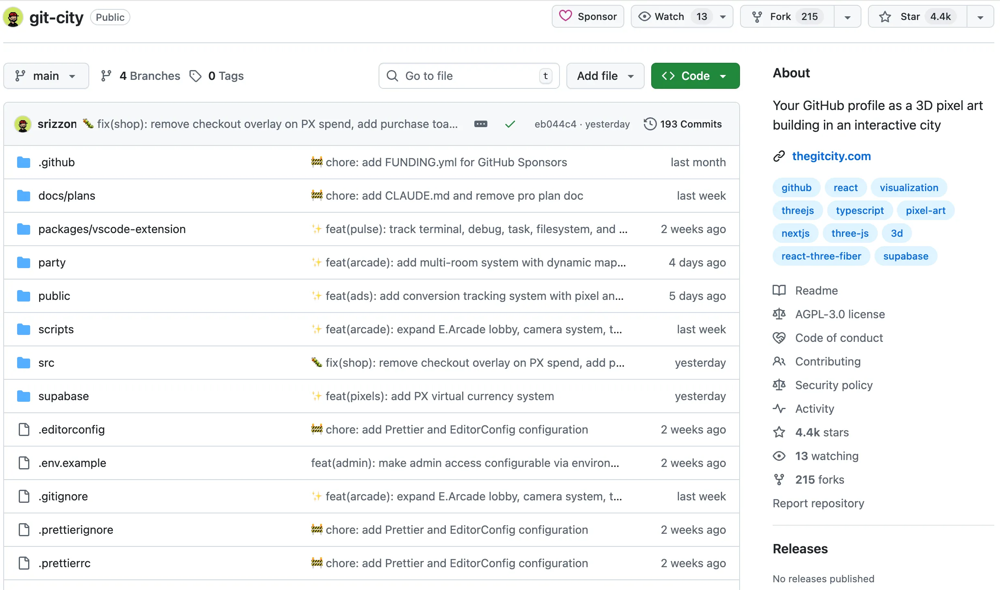
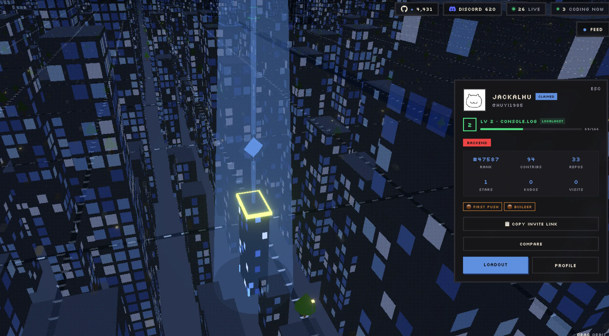
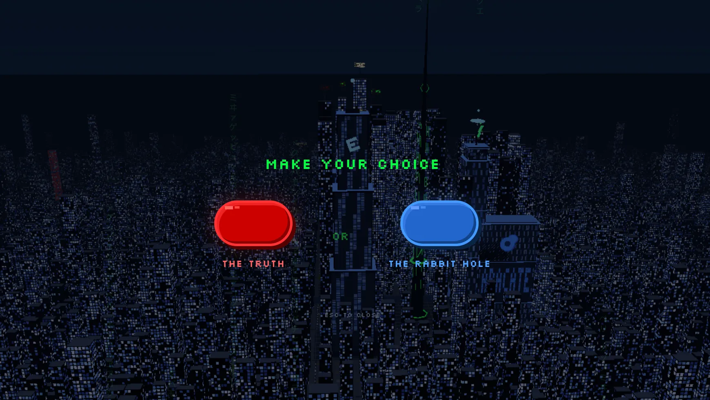

# 如果GitHub是一座城市，你的代码大厦有没有三四层楼那么高？

如果把 GitHub 比作一个不断扩张的大都市，而你在其中或是坐拥一座高耸的摩天楼，或是守着一栋安静的小屋……

现在，一个名为 **Git City** 的开源项目（🔗github.com/srizzon/git-city）将这个略带隐喻的想法，变成了一种可以亲眼看到、甚至能亲自“走进去”的体验。

打开浏览器，输入网址🔗 thegitcity.com，再输入 GitHub 上的用户名，一座可以自由漫游其中的 3D 城市便会呈现在眼前。聚光灯照射之下的那栋建筑就是属于你的。大楼的高度、体量、灯光，全部由你贡献的代码量决定。

这座“城市”的灵感，来自一个开发者都熟悉的界面：GitHub 的贡献图。绿色小方块一年又一年地堆叠，记录着一个人写代码的节奏。在 Git City 的创作者看来，这种表达方式太“扁平”、太枯燥了。于是他们换了一个角度思考——如果这些数据不是深浅不一的“小方格”，而是“建筑”，会发生什么？如果所有开发者的贡献汇聚在一起，会不会形成一座城市？

这个想法最终变成了现实。在 Git City 里，提交次数变成楼层高度，仓库数量影响建筑的占地，活跃度则映射为夜晚的灯光。一眼望去，谁活跃、谁沉寂，几乎不需要解释。

第一次进入这座城市时，很难把眼前的景象当作一个传统意义上的“数据可视化工具”。更贴切的感受是**一款尚未定义类型的游戏**。你可以在空中俯瞰整个城市，也可以降低视角，在街区之间穿行，观察不同开发者的“建筑”。那些原本分散在代码仓库与提交历史中的行为，被**压缩重组为一种可漫游的形式**。

Git City 中甚至还有用来个性化建筑的商店道具系统，代表“我”与其他开发互动的 Avata 化身，在“城市”中付费投放广告的商业化元素。在这里，广告不是传统意义上的横幅或弹窗，而是以城市元素的形式出现：漂浮的飞艇、建筑外墙的屏幕、天空中的标语……

还发现了个致敬《黑客帝国》的彩蛋。

随着用户的融入，认领自己的建筑，并对它进行一定程度的改造，该项目也逐渐超出了“可视化实验”的范围。这种设计让原本被动展示的数据，变成了一种可以参与、**可以占有的东西**。你在 GitHub 上的表现，不再只是一个页面，而是这座城市中的一个“位置”。
