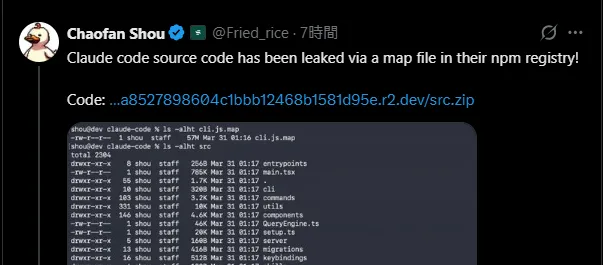
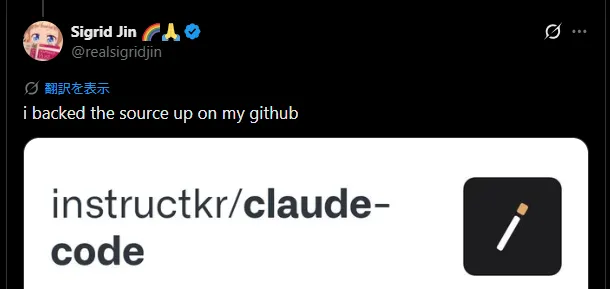
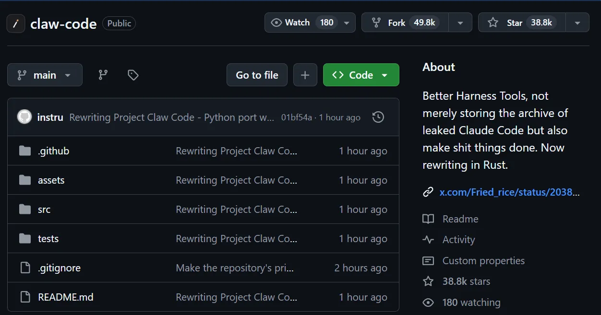
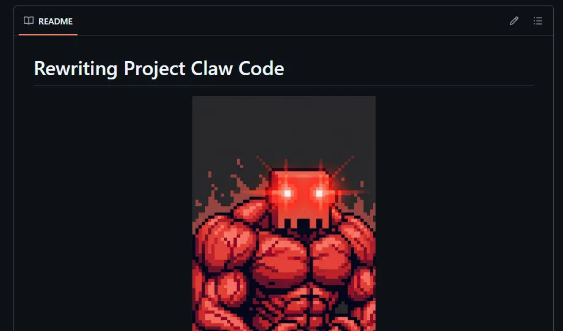
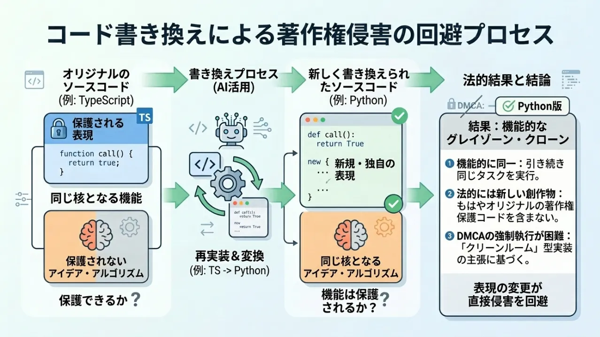
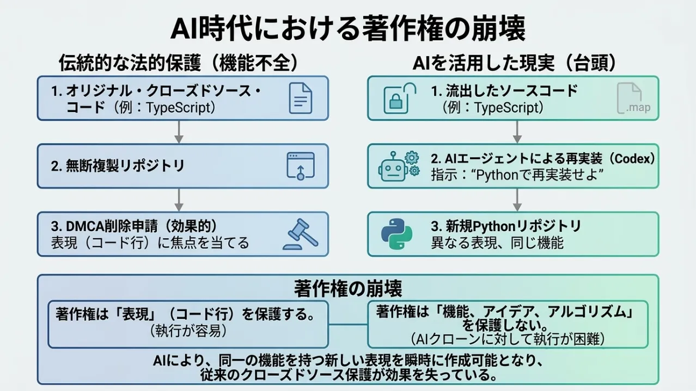
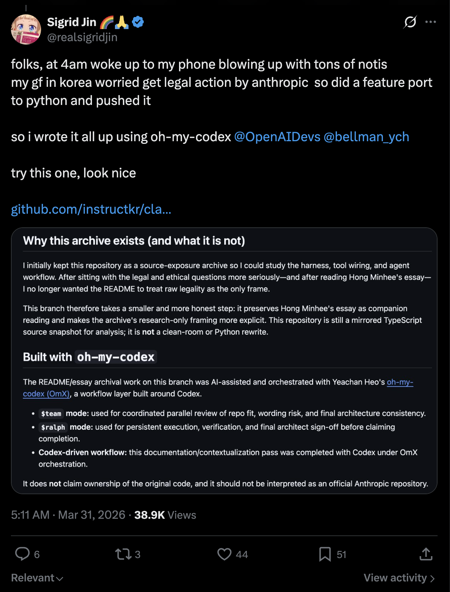
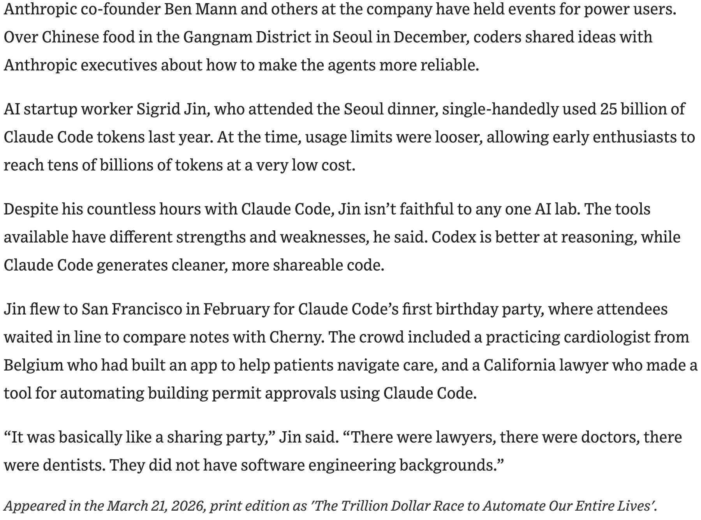

**标题**: Claude Code の流出したソースコードを GitHub に公開した人が著作権違反を回避した方法がヤバすぎ

**来源**: Qiita - 人気の投稿

**日期**: 2026-03-31

**链接**: https://qiita.com/LostMyCode/items/a867e1954b80e78cf146?utm_campaign=popular_items&utm_medium=feed&utm_source=popular_items

  

**推荐理由**:

又一起关于Claude Code的源代码泄露事件，讲述了泄露后的处理和著作权回避策略，具有高奇闻价值。

  

**创作角度**:

- 解析事件背后的技术和法律问题
- 讨论开源与知识产权保护的冲突
- 探索技术社区对此类事件的反应和态度
- 閉じたソースコードはもう守れない時代になったということです。


# Claude Code の流出したソースコードを GitHub に公開した人が著作権違反を回避した方法がヤバすぎ

LostMyCode2-3 minutes

---

3月31日、AnthropicのAIコーディングツール「Claude Code」の**全ソースコード**が突如としてネット上に流出しました。

原因はなんと、npmパッケージに含まれた **.map（sourcemap）ファイル** 。

[](https://qiita-user-contents.imgix.net/https%3A%2F%2Fqiita-image-store.s3.ap-northeast-1.amazonaws.com%2F0%2F576748%2F42469e66-ac0a-4fca-85f2-e0b5a04dbcc9.png?ixlib=rb-4.0.0&auto=format&gif-q=60&q=75&s=b5fafc0eb37b0d8a6e7fe73cd22a80ab)

Bunでビルドしたときにデフォルトで生成されるsourcemapに、元々のTypeScriptソースが丸ごと埋め込まれていたのです。

これによりソースマップ経由でソースコードが流出しました。しかし、ヤバいのはここからです。

### [](chrome-extension://ecabifbgmdmgdllomnfinbmaellmclnh/data/reader/template.html#%E6%B5%81%E5%87%BA%E5%8D%B3%E3%83%90%E3%83%83%E3%82%AF%E3%82%A2%E3%83%83%E3%83%97dmca%E9%80%A3%E7%99%BA)流出→即バックアップ→DMCA連発

最初に流出を報告したのは Fried_rice 氏。

公開されたZIP（src.zip）には、Claude Codeの全アーキテクチャ、システムプロンプト、ツール群、未公開機能フラグ（KAIROS、BUDDY、ULTRAPLANなど）、Undercover Modeまで完璧に含まれていました。

すぐに realsigridjin 氏がGitHubにバックアップを作成しました。

[](https://qiita-user-contents.imgix.net/https%3A%2F%2Fqiita-image-store.s3.ap-northeast-1.amazonaws.com%2F0%2F576748%2F6878eca2-c538-4094-9b62-0619e2d88413.png?ixlib=rb-4.0.0&auto=format&gif-q=60&q=75&s=eae4c76b7401f3b2a3e7534aecdae60b)

しかしAnthropic側は即座に動き、**DMCA（著作権侵害削除要請）** を連発。  
オリジナルコードをそのままホスティングしていたリポジトリは次々と削除されていきました。  
「著作権侵害だから当然」ここまでは普通の話です。

### [](chrome-extension://ecabifbgmdmgdllomnfinbmaellmclnh/data/reader/template.html#%E3%81%9D%E3%81%93%E3%81%A7%E5%BD%BC%E3%81%8C%E3%81%A8%E3%81%A3%E3%81%9F%E8%A1%9D%E6%92%83%E3%81%AE%E5%9B%9E%E9%81%BF%E7%AD%96)そこで彼がとった衝撃の回避策

ところが、realsigridjin 氏が取った次の行動が**完全に規格外**でした。

**同じリポジトリをPythonで完全リライトして再公開したのです。**

- 元：TypeScript（Anthropic公式コードそのもの）
- 新：Python（Codex／oh-my-codexを使ってAIが自動変換・再実装）

[](https://qiita-user-contents.imgix.net/https%3A%2F%2Fqiita-image-store.s3.ap-northeast-1.amazonaws.com%2F0%2F576748%2F2ad3f7d2-dfa6-4e8a-8d79-eb8456b6e9d2.png?ixlib=rb-4.0.0&auto=format&gif-q=60&q=75&s=ce5a4c4746e57382deaf57437f7b5c90)

彼が作成したリポジトリは、**機能はほぼ同一**なのに「著作権侵害ではない」と主張できる形になりました。 （ここは賛否ありそうですが、少なくともまだ削除されていない）

しかもこのリライト作業は**数時間で完了**。AIエージェントに投げて「Claude CodeをPythonで再実装せよ」と指示しただけで終わったと言われています。

[](https://qiita-user-contents.imgix.net/https%3A%2F%2Fqiita-image-store.s3.ap-northeast-1.amazonaws.com%2F0%2F576748%2Fcfb54e51-2c26-42b8-a93a-0eb9689265bd.png?ixlib=rb-4.0.0&auto=format&gif-q=60&q=75&s=43cc94985189643139970dac655710ea)

Gergely Orosz氏（＠GergelyOrosz）が的確に指摘した通り：

> 「copyright does not protect derived works. Rewriting TypeScript code in Python means copyright no longer applies.」

（著作権は「派生作品」を保護しない。TypeScriptをPythonに書き直せば著作権は適用されなくなる）

### [](chrome-extension://ecabifbgmdmgdllomnfinbmaellmclnh/data/reader/template.html#%E3%81%AA%E3%81%9C%E3%81%93%E3%82%8C%E3%81%A7%E8%91%97%E4%BD%9C%E6%A8%A9%E9%81%95%E5%8F%8D%E3%82%92%E5%9B%9E%E9%81%BF%E3%81%A7%E3%81%8D%E3%82%8B%E3%81%AE%E3%81%8B)なぜこれで著作権違反を回避できるのか？

[](https://qiita-user-contents.imgix.net/https%3A%2F%2Fqiita-image-store.s3.ap-northeast-1.amazonaws.com%2F0%2F576748%2Ff9bf1087-6f7c-4c73-8726-ee8f6a584eab.png?ixlib=rb-4.0.0&auto=format&gif-q=60&q=75&s=341f54032d67477eaf912f28c0f25c6f)

著作権法の基本原則は **「表現」を保護するが、「アイデア・機能・アルゴリズム」は保護しない**というもの。

- 同じロジックを別の言語でゼロから書き直す＝「表現が違う」
- AIが自動変換したとしても、人間が「仕様を見て再実装した」と主張できる

つまり「翻訳版」や「別言語ポート版」は、**法的にはグレーゾーンど真ん中**ですが、**実務上はDMCAが非常に通りづらい**のです。  
実際、このPython版は今も生き残っており、スター数も爆速で伸び続けています。

Anthropicにとっては最悪の展開です。

- DMCAで消しても「Python版」が残る
- 消そうとすれば「AIが作った派生作品まで著作権で縛るのか？」という大論争を巻き起こす
- 自分たちが作っているClaude/Code系ツールの存在意義自体を脅かす

補足: **ただし、「ゼロから」が重要です。**

元のコードを直接見てコピー＆ペーストしたり、構造を細かく模倣したりすると、翻案権侵害になる可能性があります。単なる「翻訳」や機械的な置き換えは、表現の類似性が争点になります。

### [](chrome-extension://ecabifbgmdmgdllomnfinbmaellmclnh/data/reader/template.html#%E3%81%93%E3%82%8C%E3%81%8C%E6%84%8F%E5%91%B3%E3%81%99%E3%82%8Bai%E6%99%82%E4%BB%A3%E3%81%AE%E8%91%97%E4%BD%9C%E6%A8%A9%E5%B4%A9%E5%A3%8A)これが意味する「AI時代の著作権崩壊」

[](https://qiita-user-contents.imgix.net/https%3A%2F%2Fqiita-image-store.s3.ap-northeast-1.amazonaws.com%2F0%2F576748%2F74c512eb-3e22-4e2f-bd68-d869ac7cc6d2.png?ixlib=rb-4.0.0&auto=format&gif-q=60&q=75&s=9109b877e5c59f42b953c7da5f2a0888)

この一件で明らかになったのは、閉じたソースコードはもう守れない時代になったということです。

- AIエージェントを使えば、57MBのTypeScriptを数時間でPythonに変換可能
- 言語を変えるだけで「著作権侵害ではない」と主張できる（とはいえここは怪しい）
- 世界中の開発者が「流出→即リライト→公開」の流れを学習済み

もはや「ソースコードを隠しておく」こと自体が、難しくなりつつあります。  
Anthropicがどれだけ安全第一を掲げようと、**一つのnpm publishミスで全ソースが晒され、AIが一瞬で合法クローンを生み出す**時代が到来してしまったのです。

### [](chrome-extension://ecabifbgmdmgdllomnfinbmaellmclnh/data/reader/template.html#%E6%9C%80%E5%BE%8C%E3%81%AB)最後に

＠realsigridjin 氏の行動は、まさに「ヤバすぎ」  
法的にはギリギリ、倫理的には超攻撃的、技術的には天才的。  
しかも自分の彼女が「Anthropicから訴えられるかも」と心配したからやった、というオチまで完璧です。

これが2026年の現実なんだなと。  
Claude Codeの流出は単なる事故ではなく、**AIが著作権というルールを壊し始めた瞬間**だったのかもしれないですね。

追記  
4/1 現在、まだ彼のリポジトリ instructkr/claw-code は削除されていません。今後どうなるのか注目です。

----

# Github Readme

**⭐ The fastest repo in history to surpass 50K stars, reaching the milestone in just 2 hours after publication ⭐**

[](https://star-history.com/#instructkr/claw-code&Date)

[](https://github.com/ultraworkers/claw-code/blob/main/assets/clawd-hero.jpeg)
**⭐ The fastest repo in history to surpass 50K stars, reaching the milestone in just 2 hours after publication ⭐**
**Better Harness Tools, not merely storing the archive of leaked Claw Code**

[](https://github.com/sponsors/instructkr)

Important

**Rust port is now in progress** on the [`dev/rust`](https://github.com/instructkr/claw-code/tree/dev/rust) branch and is expected to be merged into main today. The Rust implementation aims to deliver a faster, memory-safe harness runtime. Stay tuned — this will be the definitive version of the project.

> If you find this work useful, consider [sponsoring @instructkr on GitHub](https://github.com/sponsors/instructkr) to support continued open-source harness engineering research.

---

## Rust Port

[](https://github.com/ultraworkers/claw-code/tree/main#rust-port)

The Rust workspace under `rust/` is the current systems-language port of the project.

It currently includes:

- `crates/api-client` — API client with provider abstraction, OAuth, and streaming support
- `crates/runtime` — session state, compaction, MCP orchestration, prompt construction
- `crates/tools` — tool manifest definitions and execution framework
- `crates/commands` — slash commands, skills discovery, and config inspection
- `crates/plugins` — plugin model, hook pipeline, and bundled plugins
- `crates/compat-harness` — compatibility layer for upstream editor integration
- `crates/claw-cli` — interactive REPL, markdown rendering, and project bootstrap/init flows

Run the Rust build:

```shell
cd rust
cargo build --release
```

## Backstory

[](https://github.com/ultraworkers/claw-code/tree/main#backstory)

At 4 AM on March 31, 2026, I woke up to my phone blowing up with notifications. The Claw Code source had been exposed, and the entire dev community was in a frenzy. My girlfriend in Korea was genuinely worried I might face legal action from the original authors just for having the code on my machine — so I did what any engineer would do under pressure: I sat down, ported the core features to Python from scratch, and pushed it before the sun came up.

The whole thing was orchestrated end-to-end using [oh-my-codex (OmX)](https://github.com/Yeachan-Heo/oh-my-codex) by [@bellman_ych](https://x.com/bellman_ych) — a workflow layer built on top of OpenAI's Codex ([@OpenAIDevs](https://x.com/OpenAIDevs)). I used `$team` mode for parallel code review and `$ralph` mode for persistent execution loops with architect-level verification. The entire porting session — from reading the original harness structure to producing a working Python tree with tests — was driven through OmX orchestration.

The result is a clean-room Python rewrite that captures the architectural patterns of Claw Code's agent harness without copying any proprietary source. I'm now actively collaborating with [@bellman_ych](https://x.com/bellman_ych) — the creator of OmX himself — to push this further. The basic Python foundation is already in place and functional, but we're just getting started. **Stay tuned — a much more capable version is on the way.**

The Rust port was developed with both [oh-my-codex (OmX)](https://github.com/Yeachan-Heo/oh-my-codex) and [oh-my-opencode (OmO)](https://github.com/code-yeongyu/oh-my-openagent): OmX drove scaffolding, orchestration, and architecture direction, while OmO was used for later implementation acceleration and verification support.

[https://github.com/instructkr/claw-code](https://github.com/instructkr/claw-code)

[](https://github.com/ultraworkers/claw-code/blob/main/assets/tweet-screenshot.png)

## The Creators Featured in Wall Street Journal For Avid Claw Code Fans

[](https://github.com/ultraworkers/claw-code/tree/main#the-creators-featured-in-wall-street-journal-for-avid-claw-code-fans)

I've been deeply interested in **harness engineering** — studying how agent systems wire tools, orchestrate tasks, and manage runtime context. This isn't a sudden thing. The Wall Street Journal featured my work earlier this month, documenting how I've been one of the most active power users exploring these systems:

> AI startup worker Sigrid Jin, who attended the Seoul dinner, single-handedly used 25 billion of Claw Code tokens last year. At the time, usage limits were looser, allowing early enthusiasts to reach tens of billions of tokens at a very low cost.
> 
> Despite his countless hours with Claw Code, Jin isn't faithful to any one AI lab. The tools available have different strengths and weaknesses, he said. Codex is better at reasoning, while Claw Code generates cleaner, more shareable code.
> 
> Jin flew to San Francisco in February for Claw Code's first birthday party, where attendees waited in line to compare notes with Cherny. The crowd included a practicing cardiologist from Belgium who had built an app to help patients navigate care, and a California lawyer who made a tool for automating building permit approvals using Claw Code.
> 
> "It was basically like a sharing party," Jin said. "There were lawyers, there were doctors, there were dentists. They did not have software engineering backgrounds."
> 
> — _The Wall Street Journal_, March 21, 2026, [_"The Trillion Dollar Race to Automate Our Entire Lives"_](https://lnkd.in/gs9td3qd)

[](https://github.com/ultraworkers/claw-code/blob/main/assets/wsj-feature.png)
