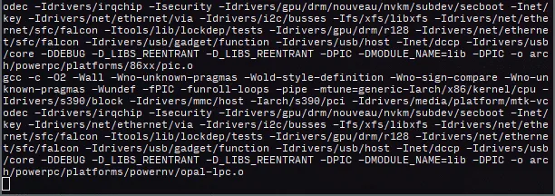
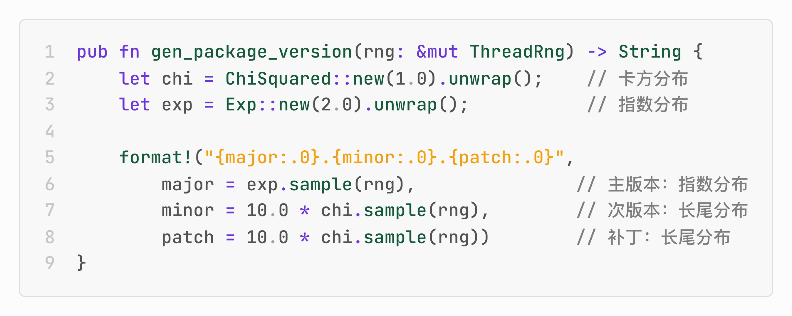
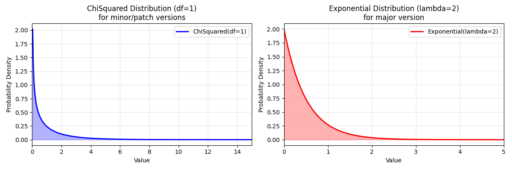
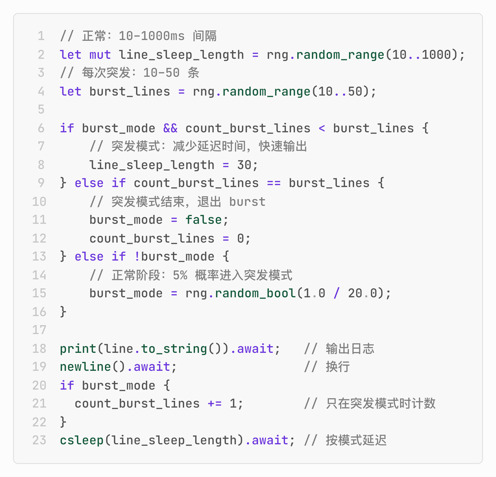

# 忙碌是可以伪造的，一条命令进入正在做事的状态

在办公室里，有时候其实并没有那么忙，但必须**装**得很忙。

手指把键盘敲得噼啪作响；终端窗口中的字符飞快滚动；IDE、浏览器、聊天工具不断切换……

但你有没有想过，这种“看起来在做事”的信号其实也可以被**低成本模拟**，甚至连装得很忙都不用装，**只一条命令**，你就是忙得焦头烂额的那个人。

`genact` 就是这样一个工具：**没有工作也能在终端里“创造”工作量**，让你看起来很忙、很专业。

一行命令下去，上百个源文件的大型项目就开始编译了，编程语言的包管理器就开始安装依赖了，Web 服务器的日志就不断输出了……




但本质上，genact 除了向屏幕输出字符串以外，什么都没做。

现在无需安装，就可以在浏览器里直接体验这个命令。通过不同的 `module` 参数来切换正在进行的工作，比如🔗 https://svenstaro.github.io/genact/?module=uv。

可选的 `module` 包括：`ansible, bootlog, botnet, bruteforce, cargo, cc, composer, cryptomining, docker_build, docker_image_rm, download, julia, kernel_compile, memdump, mkinitcpio, rkhunter, simcity, terraform, uv, weblog, wpt`。

别看只是“造假”，genact 在这件事上可还挺认真的呢。比如在**伪造软件包版本号**时，它没有使用简单的随机整数，而是引入了概率分布：



```rust
pub fn gen_package_version(rng: &mut ThreadRng) -> String {
    let chi = ChiSquared::new(1.0).unwrap();   // 卡方分布
    let exp = Exp::new(2.0).unwrap();           // 指数分布

    format!("{major:.0}.{minor:.0}.{patch:.0}",
        major = exp.sample(rng),               // 主版本：指数分布
        minor = 10.0 * chi.sample(rng),        // 次版本：长尾分布
        patch = 10.0 * chi.sample(rng))        // 补丁：长尾分布
}
```

这是因为指数分布的特点是大多数值集中在较小区间，非常符合软件主版本（`major`）缓慢演进的直觉。而卡方分布则带有明显的长尾特征，适合用来模拟次版本（`minor`）和补丁号（`patch`）的碎片化演进。



`genact` 不仅模拟数字，还调整了输出的节奏。

真实的 Web 服务器日志不会匀速输出，而是忽快忽慢；因为流量本身就不是均匀分布的，平时安静，一旦触发事件就突然密集爆发，比如大量失败重试、爬虫抓取等。



```rust
// 正常：10–1000ms 间隔
let mut line_sleep_length = rng.random_range(10..1000);
// 每次突发：10–50 条
let burst_lines = rng.random_range(10..50);

if burst_mode && count_burst_lines < burst_lines {
    // 突发模式：减少延迟时间，快速输出
    line_sleep_length = 30;
} else if count_burst_lines == burst_lines {
    // 突发模式结束，退出 burst
    burst_mode = false;
    count_burst_lines = 0;
} else if !burst_mode {
    // 正常阶段：5% 概率进入突发模式
    burst_mode = rng.random_bool(1.0 / 20.0);
}

print(line.to_string()).await;   // 输出日志
newline().await;                  // 换行
if burst_mode {
  count_burst_lines += 1;       // 只在突发模式时计数
}
csleep(line_sleep_length).await;  // 按模式延迟
```
