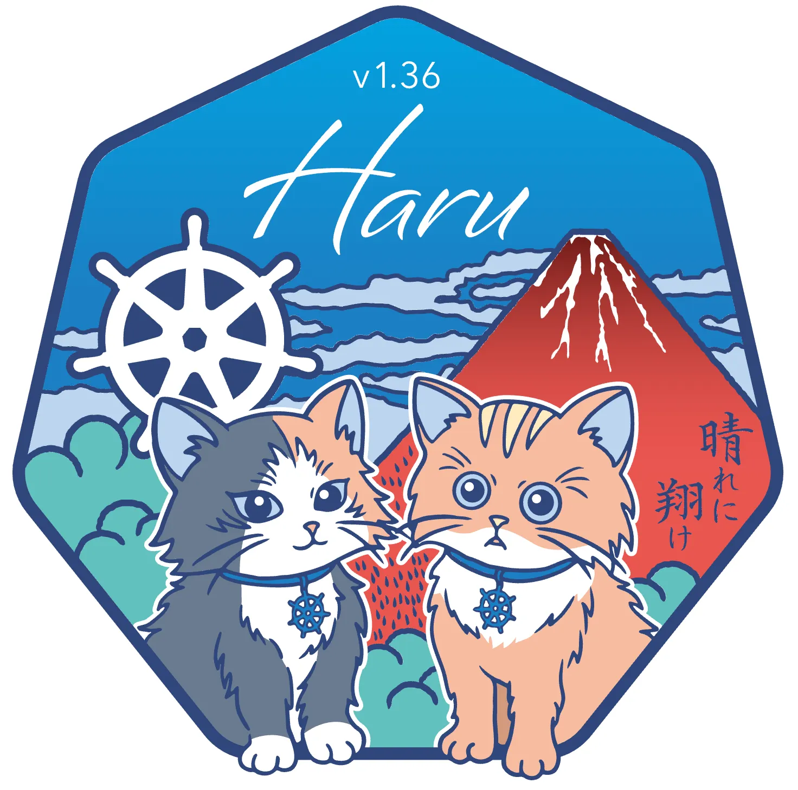
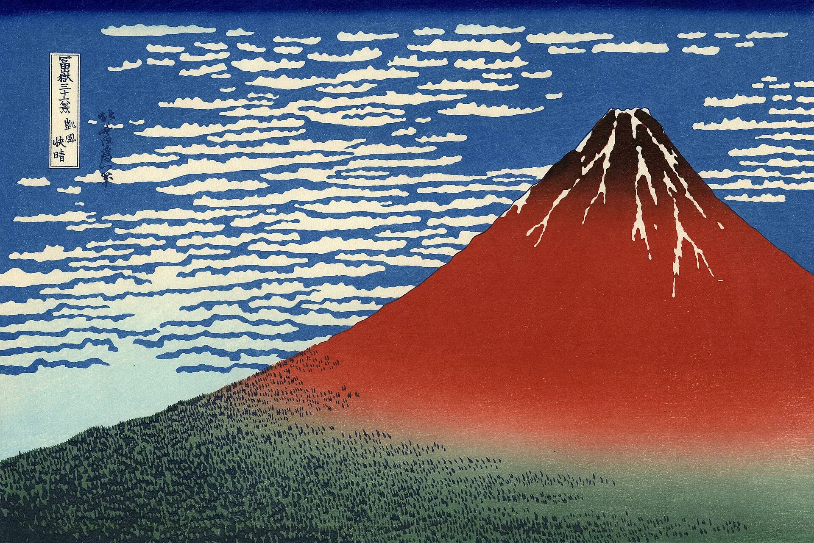
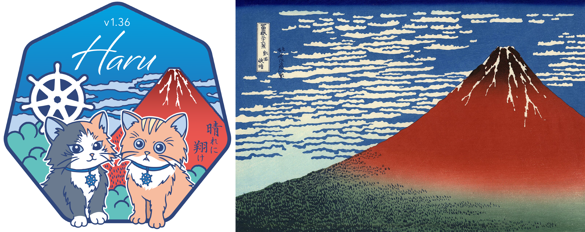

# Kubernetes v1.36 logo中的日本元素

这是 Kubernetes v1.36 的 logo。

logo 整体设计源自日本浮世绘艺术家**葛饰北斋**的代表作《富岳三十六景》中的《凯风快晴》（又称“赤富士”）。

画中清晨的富士山被阳光染成红色，下方是树海，上方是晴朗的天空，山顶仍覆着残雪。“凯风”一词取自《诗经》，意思是夏天吹拂的轻柔南风。

Haru（ハル）这个音节在日语中既是“春天”，也能让人联想到放晴的“晴れ”（Hare），以及指向远方的“遥か”（Haruka）。

富士山脚下的两只猫颈间佩戴着 Kubernetes 的舵轮标志，如同日本神社中的**狛犬**（类似石狮子），一左一右成对而立，象征守护与平衡。

在赤色的山体上，写着一句诗的前半句：“晴れに翔け”，意为“飞向晴朗的天空”。完整的诗句为：

**晴れに翔け、未来よ明け**：飞向晴朗的天空，迎来明日的黎明。

🔚