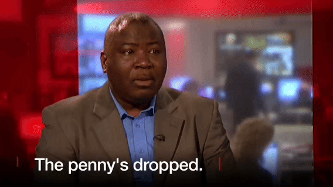
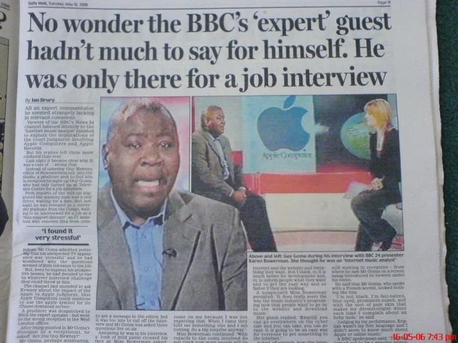

# 本想应聘一份IT工作，却阴差阳错走进了BBC的直播节目

来自刚果共和国的 Guy Goma 原本只是前来**应聘一份 IT 工作**，却意外走进了 BBC 的直播演播室。

2006 年 5 月的一个清晨，BBC 发生了一起**直播乌龙事件**。由于身份误认，一位前来 BBC 总部应聘 IT 岗位的求职者，被当作受邀专家推上了直播采访席。

这段离奇经历的起点很普通，Guy Goma 收到了 BBC 数据专员岗位的面试通知。当天，他在 BBC 总部大厅安静等候，而 BBC 24 小时新闻频道的制片人 Elliott Gotkine 正从楼上下来，准备迎接那天的直播嘉宾。

制片人原本要接待的是一位音乐产业专家，讨论一桩当时备受关注的法律案件：围绕“苹果 vs 苹果”的商标纠纷。案件双方分别是科技公司 Apple Inc.与披头士相关的唱片公司 Apple Corps。随着 iTunes 等数字音乐服务的兴起，Apple Corps 认为 Apple Inc.已经从原本的“科技公司”身份，逐渐进入音乐发行与分销领域，从而跨越了双方此前的商标协议边界。

**巧合的是**，这位嘉宾也叫“Guy”，全名是 Guy Kewney。

也许是制片人在匆忙中没有核对全名；也可能是 Guy Goma 在紧张之下，将对方完整的问题“Are you Guy Kewney?”只捕捉成了前半句“Are you Guy”。

总之，**误会就这样发生了**。简单几句寒暄之后，制片人便将 Guy Goma 带离大厅，匆匆走向一间为直播准备的演播室。

对 Guy Goma 来说，细节开始一点点变得不对劲，但一切又快得来不及细想：一个普通的 IT 数据专员面试，值得由 BBC 的制片人亲自接待吗？为什么突然有人走过来说要帮他化妆、甚至准备上镜？更让他困惑的是，迎面走来的那位女士，不正是他在电视上经常看到的主持人 Karen Bowerman 吗？

突然，房间里的几块监视屏同时亮起，Guy Goma 的脸赫然出现在每一块屏幕上。

“**糟了，我走错地方了**。”

还没等他来得及解释，主持人 Karen Bowerman 已经开口进入直播流程。当他听到“有请**今天的嘉宾 Guy Kewne**y”时，整个人明显僵住，嘴唇不受控制地微微颤动，像是想说点什么，却又完全接不上话。紧张之下，他努力想把嘴合拢，却越是用力越显得局促，甚至露出了**粉粉的舌尖**。

但就在一瞬之间，Guy Goma 冷静了下来。他后来回忆说，那一刻脑海中仿佛响起了母亲的声音——她一直教他，要尊重他人，也不要轻易放大别人的失误。

于是，他调整了一下呼吸，先礼貌地回应了主持人的问候：“早上好。”

随后，他顺着流程回答了第一个问题：“是的，我感到非常惊讶。”

有趣的是，主持人当时问的是“你是否对这起苹果 vs 苹果案件的判决感到惊讶”，而 Guy Goma 口中的“惊讶”，听起来更像是在描述另一件事——他对自己被误带进 BBC 直播间、甚至正在对全国观众“即兴出演专家”这件事本身，感到非常惊讶。

这个回答显然超出了主持人的预期，于是她继续追问，这起案件是否会改变消费者的行为，以及未来是否会有更多人选择通过互联网下载音乐。

“没错，”Guy Goma 用一种略显笨拙却流畅的英语回答道，“对每个人来说，从网上下载音乐会变得非常方便，这会成为一种很简单的获取音乐的方式。”

在这一刻，他用最朴素、最直接的语言，真的像一位专家那样，对未来的音乐消费方式做出了某种近乎直觉式的判断。

身经百战的主持人显然察觉到了些许异样，采访很快被礼貌地收尾。

这段仅有 80 秒的直播片段之所以至今仍被反复提起，并不只是因为乌龙本身，而是在于 Guy Goma **在极度突发的压力下**，从慌乱到稳定，再到能够清晰表达观点的整个过程。

这起乌龙事件随后迅速在互联网上走红。凭借那段出人意料的“沉着应对”，Guy Goma 让许多曾在职场中感到措手不及、难以应对突发状况的人**产生了共鸣**。那种“被突然推上台”的体验，对很多在工作中准备不足的人来说，或许都不算陌生。

采访结束后，Guy Goma 向 BBC 工作人员说明了情况。

之后，他完成了原本那场 IT 岗位的面试，只是最终没有被录用。

🔚