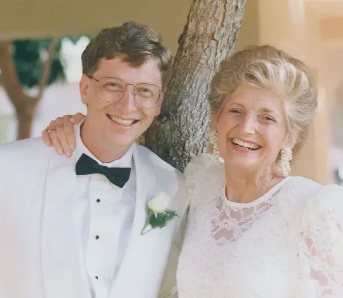

# 比尔·盖茨的母亲对该不该用TAB键不感兴趣

微软资深工程师 Raymond Chen 近日在其博客中回顾了一则趣闻。

当时，微软与 IBM 正在联合开发 OS/2。两家公司在文化与工程风格上存在显著差异：微软倾向于**快速决策与实用主义**，而 IBM 则更依赖**层层审批与流程控制**。这种差异无处不在，甚至体现在一个极小的界面细节上——在对话框中，TAB 键能否用于控制光标（焦点）在文本框等控件之间跳转。

据一位微软工程师回忆，他被派驻至 IBM 位于佛罗里达的办公点。在一次界面设计讨论中，他决定采用 TAB 键作为跳转键，但这一决定随即遭到 IBM 团队的反对。

理由并非 TAB 键本身的利弊，而是 IBM 认为，此类设计必须经过更高层级的审批，并要求将问题上报至微软总部。

该工程师的直属经理在收到反馈后回应：“你被派去 IBM，就是为了在那里替我做这些决定的。”

于是，这一回复被改写为更符合跨公司沟通风格的版本——“微软支持使用 TAB 键作为跳转键”。

IBM 并未立即给出结论，而是沿其组织架构继续上报。数个层级之后，一位副总裁——约高出开发人员**七个管理层级**——明确反对使用 TAB 键，并要求微软**对等层级**的管理者给出正式立场。

面对这一跨层级的正式确认请求，微软的工程师回应道：

“比尔·盖茨的母亲对该不该用 TAB 键不感兴趣。”

这句玩笑最终使得 TAB 键作为跳转键得以保留。