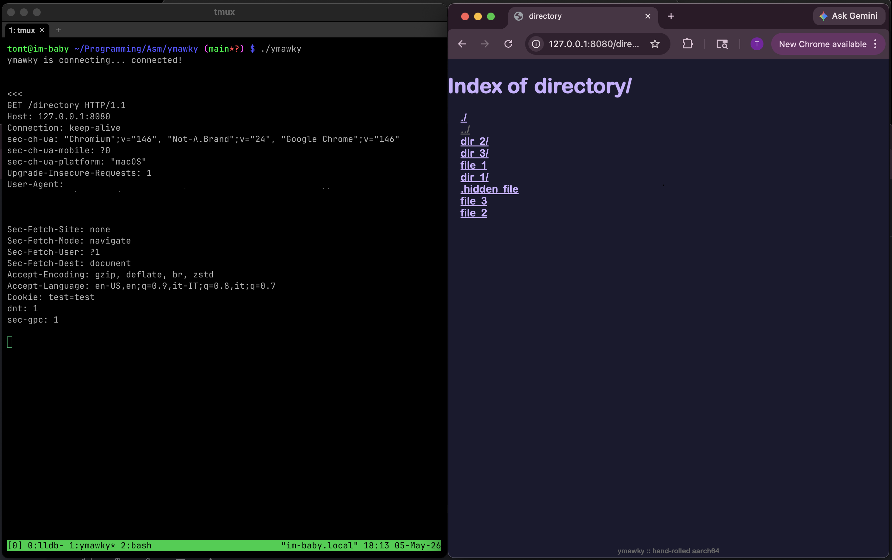
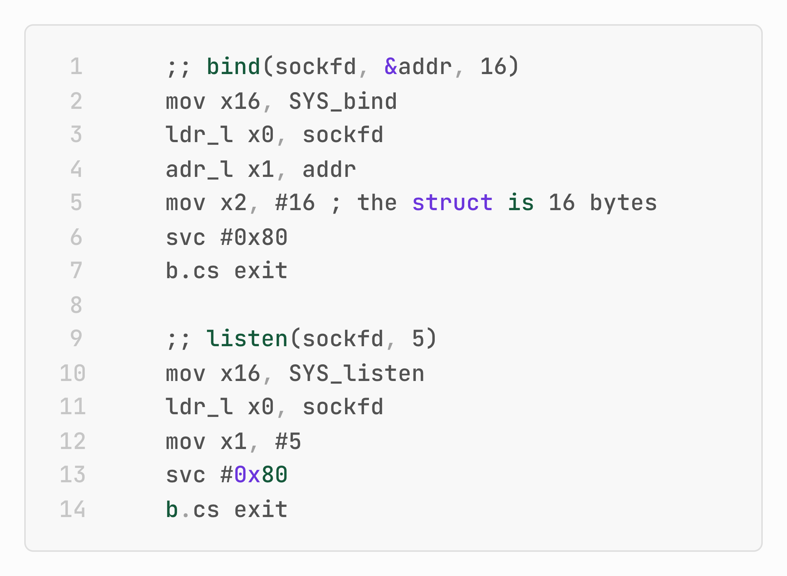

# 何意味？有人用汇编语言写了个HTTP服务器

先问两个问题：

你用汇编语言写过程序吗？

你自己实现过 HTTP 服务器吗？

大多数人的答案恐怕都是“没有”。理由也很简单：既麻烦，又没什么必要。

想输出一句 `Hello, World!`，用 Go、Python、Java 这样的高级语言，往往一两行代码就够了。HTTP 服务器 就更不用说了：Nginx、Apache、Caddy……现成方案一大堆；语言标准库里还有 Go 的 `net/http`、Python 的 `http.server`、Node.js 的 `http`……随便挑一个，几分钟就能跑起来。

但偏偏有人把这两件今天看来**既繁琐、又完全没必要**的事情合在一起，全做了一遍。

这个项目叫 ymawky（🔗 https://github.com/imtomt/ymawky）。



这是一个完全用 **AArch64 汇编**实现的 HTTP 服务器。AArch64 是 ARM 64 位架构的汇编语言，也就是今天 Apple Silicon、大量移动设备以及 ARM 服务器底层直接执行的机器指令集。

整个项目大约 **6600 行代码**，其中一半是汇编指令，另一半是注释和数据定义。代码没有依赖任何库：从字符串比较、内存拷贝，到整数与字符串转换、URL 特殊字符编码与解码，全部由手写汇编实现。


ymawky HTTP 服务器 支持 GET、POST、PUT、DELETE 等 HTTP 方法，还支持 CGI 脚本，以及 21 种 HTTP 状态码。

甚至，它还隐藏了一个彩蛋。

如果发送 `BREW` 方法的请求：

```
curl -s -i -XBREW 'http://127.0.0.1:8080/'
```

ymawky 服务器会返回：

```
HTTP/1.1 418 I'm a teapot
Content-Length: 0
Connection: close
Allow: GET, HEAD, OPTIONS, DELETE, PUT
Accept-Ranges: bytes
Server: ymawky
```

`418` 这个状态码来自 1998 年 4 月 1 日发布的 RFC 2324。那天，IETF 一本正经地发布了一份名为《Hyper Text Coffee Pot Control Protocol》的愚人节 RFC，尝试定义一种用 HTTP 控制咖啡机的协议。

文档中定义了 `BREW`、`POUR` 等用于“网络咖啡壶”的方法，并规定：如果有人要求一台茶壶煮咖啡，它应该返回 `418 I'm a teapot`——因为茶壶不会煮咖啡。


从实用角度看，ymawky 几乎没有现实价值。但作者却说：如果只是让 AI 帮我生成一个汇编语言写的 HTTP 服务器，那意义何在？

某种程度上，这正是 ymawky 的全部意义所在。

🔚
