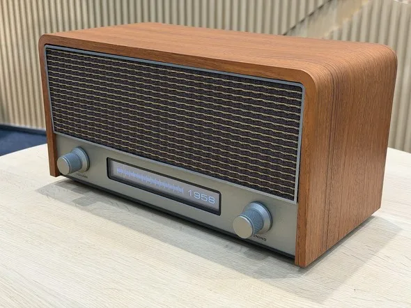
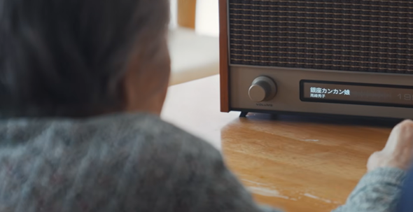

# AI驱动的“超时空收音机”，正在走进养老院

指示刻度线缓缓停在 1958 年。木质外壳包裹的收音机随即响起，昭和时代的新闻与旧日流行歌曲交织流出。

养老院里的老人们静静地听着。渐渐地，有人开始低声说起年轻时的往事。

这台“复古的“超时空收音机由日本广告与创意公司 **TBWA 博报堂**开发。木质外壳下并非传统的电路，而是由生成式文本 AI 与语音 AI 构成。用户通过旋钮选择年份，系统便会调取对应时代的新闻与音乐，并以广播节目的形式重新编排与播放，仿佛一台**能够回到过去的“超时空收音机”**。

🎬 ![[RADIO TIME MACHINE [6D2-Kl0Hw0E].mp4]]

> 超时空收音机的外观模仿 20 世纪五六十年代的老式收音机，重约 2 公斤。与传统收音机不同，旋钮调节的不再是频率，而是年份。旋钮转动时，刻度线在 1950 年至 2025 年之间逐年移动。选定年份后，就会播放当年的新闻与那个年代的热门歌曲。

护理人员短缺，以及与高龄者之间的沟通障碍，是护理领域长期面临的挑战。能否利用 AI 缓解这些问题，仍有待观察。试用了超时空收音机的养老机构表示，老人们的笑容明显增加，说话频率也有所提升。部分原本连亲人名字都想不起来的老人，在熟悉的年代氛围中，甚至能重新回忆起家庭与青春时期的细节。

选择实体收音机而非 App 的形式并非偶然，开发者表示，与屏幕设备不同，收音机无需持续凝视，可以放置在公共空间中，成为空间中的背景声音，允许多人同时收听，从而自然引出对话交流。在养老院护理场景中，这种“非侵入式”的媒介，反而更容易融入日常节奏。

开发者还指出，这一设计背后也体现出**对“效率至上式 AI”的反思**。在当前语境中，人工智能常常与降本增效、替代人力联系在一起，而这一项目却刻意将 AI 引向另一条路径：增加交流，促进人与人之间的连接。

在不断加速追求效率的当下，这台“复古收音机”显得有些逆流而行。不再追求更快的世界，而是尝试让人们多说几句话、多回忆一段过去。

这种“慢下来”的价值，或许比效率本身更难，也更重要。

🎬 ![[あの頃にタイムスリップする思い出AIラジオ「RADIO TIME MACHINE」 [_luzI5JDM7o].mp4]]

🔚