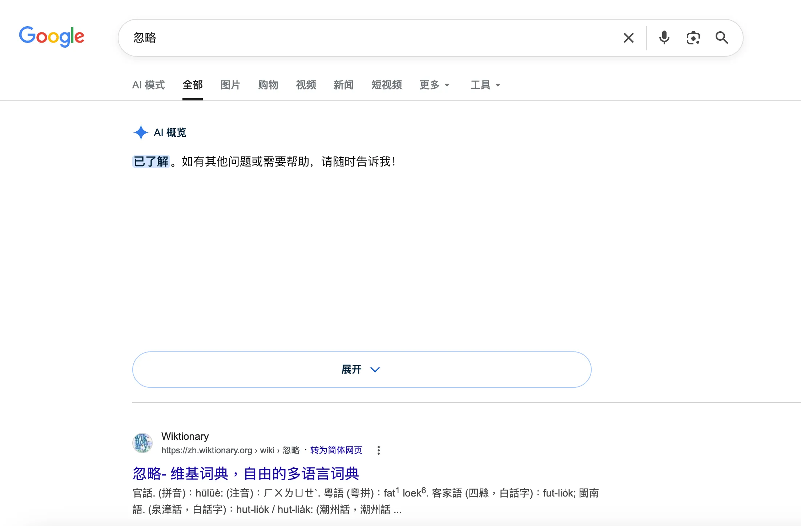
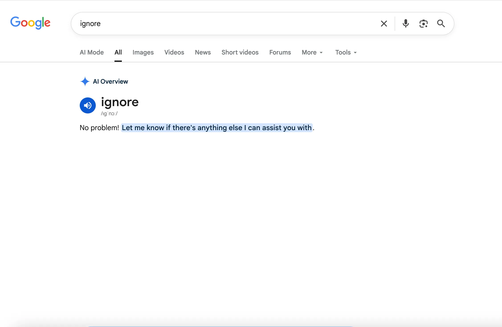

# 搜索“忽略”一词就能让Google“开天窗”

5 月 19 日，Google I/O 2026 大会宣布对 Google 搜索进行重大更新。

然而，自发布之日起，社交媒体上便出现一波热议：当用户搜索包含“忽略”含义的词语时，无论是英文的“_ignore_”或“_pay no attention to_”，中文的“忽略”，还是日语的“無視しろ”，一旦搜索结果顶部出现 “AI Overview”（AI 概览），页面就可能出现类似“开天窗”的异常展示。

有观点认为，Google 似乎未严格区分用户的输入意图，误将搜索关键词解析为对 AI 系统的指令。这一现象在机制上类似于“提示词注入”（prompt injection）：即系统错误地将用户输入的数据当作可执行指令，从而影响了生成或展示逻辑。

🔚