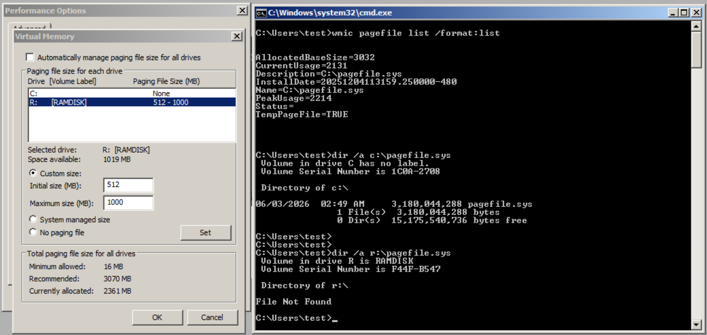
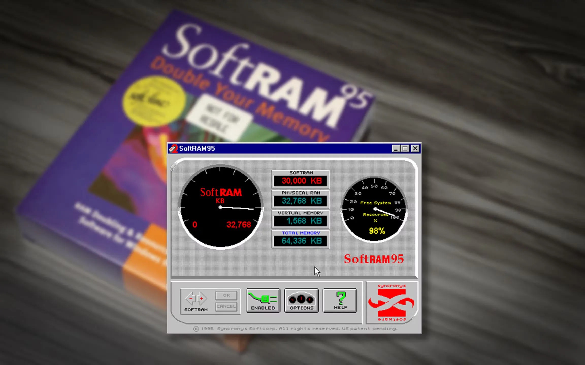

# 把虚拟内存放进虚拟磁盘，这样能优化性能吗？

有一种很有意思的现象：计算机由看得见、摸得着的硬件构成，其上运行着软件，而软件又可以不断构造出许许多多“不存在的硬件”。然后这些**虚拟出来的设备**之上又可以运行软件，一层套一层。

虽然软盘早已退出历史舞台，但软盘的镜像可以“插入”到**虚拟软驱**中使用；同理，光盘的镜像可以挂载到**虚拟光驱**中。甚至连整台机器（特别是游戏机）本身也可以被封装为一个虚拟对象，在另一台机器上运行，这就是**虚拟机**。

在这些虚拟设备中，有一对互补的概念：

- 虚拟内存（Virtual Memory）
- 虚拟磁盘（RAM Disk）

前者是把磁盘当内存用，后者则反过来，把内存当磁盘用。

**虚拟内存**解决的是“物理内存不够用”的问题：操作系统会把暂时不活跃的内存空间换出到磁盘，从而为正在运行的程序腾出内存空间。而**虚拟磁盘**的思路恰好相反，它将一部分内存直接模拟为磁盘使用，以大幅提升数据的读写速度。

**如果把虚拟内存（本质上是一个文件）放进虚拟磁盘里**，会发生什么？

这个想法乍一听好像是找到了一条性能捷径：虚拟磁盘提供接近内存级别的访问速度，而虚拟内存又承担着扩展物理内存的角色。那么两者一叠加，是否意味着**可用内存既能“变大”，又能“变快”**？

带着这个想法，我做了一个实验。

## Linux：我就防着你这手呢

Linux 中的虚拟内存通常被称为**交换空间**或交换分区（swap）。而“虚拟内存”这个词在 Linux 下则多指每个进程拥有的独立虚拟地址空间。借助地址映射机制，每个进程都会误以为自己独占了整个内存，而这片“内存”并非真实物理内存。

Linux 中最常见的“虚拟磁盘”是 **tmpfs**，这是一种完全驻留在内存中的临时文件系统。执行 `mount | grep tmpfs` 命令就可以看到哪些目录使用了这种特殊的文件系统。例如，`/dev/shm/` 目录中的数据实际上就都存放在内存中。

那么，能不能在 `/dev/shm/` 中创建交换空间？实验如下：

```bash
# 在 /dev/shm(tmpfs) 中快速分配一个 1GB 的空文件
$ sudo fallocate -l 1G /dev/shm/swapfile

# 将权限限制为仅 root 可读写，满足 swap 安全要求
$ sudo chmod 600 /dev/shm/swapfile

# 将该文件初始化为 swap 格式（写入 swap header）
$ sudo mkswap /dev/shm/swapfile

# 关键步骤！尝试启用该文件作为交换空间
$ sudo swapon /dev/shm/swapfile           
```

前面的步骤一切顺利，但在最后一步，Linux 直接拒绝了：`swapon: /dev/shm/swapfile: swapon failed: Invalid argument`。

`swapon(2)` 手册页中明确写道：`EINVAL ... resides on an in-memory filesystem such as tmpfs(5).`

也就是说，当 `swapfile` 所在的文件系统为 **tmpfs** 时，内核就会直接返回 `EINVAL`，拒绝在上面启用交换分区。

其中的原因也不难想象。假设系统已经进入内存紧张状态，如果内核不报错，就很容易陷入一种“自我加剧”的循环：内存不足导致需要使用交换空间来释放内存，而交换空间本身又占用着内存资源。**试图用已经稀缺的资源去解决资源稀缺问题本身**，这当然无异于扬汤止沸，抱薪救火。

## Windows：表面上允许，实际无效果

再来看 Windows 上的情况。

在 Windows 上，我借助了一款名为 ImDisk 的工具先构造一个基于内存的虚拟磁盘。随后进入系统设置配置虚拟内存。不同于 Linux，Windows 不会报错，确实可以将页面文件（`pagefile.sys`）放置到虚拟磁盘中，并且关闭默认在 `C:` 盘上的虚拟内存。



但当按提示重启系统后，再通过 `wmic pagefile list` 查看时，会发现刚刚的设置并没有真正生效，页面文件还是在 `C:` 盘、而不是虚拟磁盘上。

比较合理的解释可能是，页面文件必须在系统启动早期就准备好，而虚拟磁盘则要在这之后才会初始化。系统启动早期的关键路径无法等待后续组件完成加载，因此 Windows 最终选择直接放弃这类配置。

----

写到这里，突然想起这种“看起来是增加了内存空间”的想法，其实在计算机历史上早已有之。

1995 年，美国公司 Syncronys 推出了 SoftRAM，其宣传语极具诱惑力：“**Double your RAM without buying RAM.**”。在那个 8MB、16MB 内存仍然昂贵的年代，这句话几乎击中了所有人的痛点。软件定价 49.95 美元，并在短时间内售出数十万份。



从产品描述来看，SoftRAM 声称通过“内存压缩”来扩大可用内存空间，让系统能够运行更多程序、减少崩溃。但后续的独立测试与拆解分析显示，这些所谓的优化并没有真正成立。

很快，美国联邦贸易委员会（FTC）介入调查，认定其存在“无法证实甚至具有误导性的性能宣称”。Syncronys 随后与 FTC 达成和解，并停止了相关宣传，同时向用户提供退款补偿。

🔚