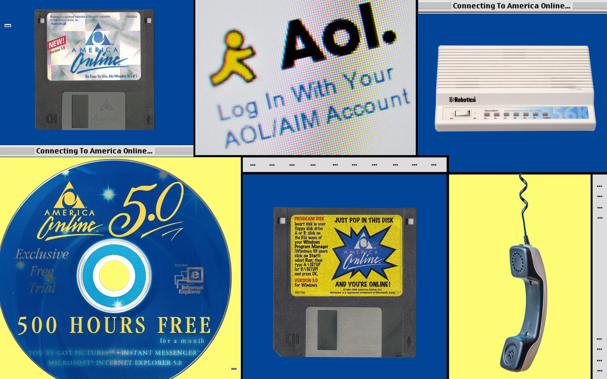
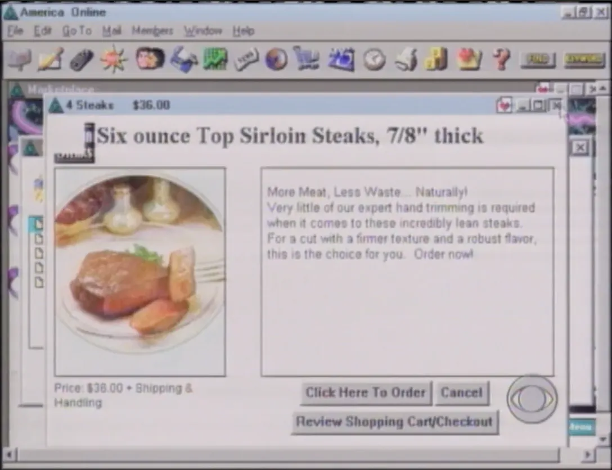

# 1996年AOL大宕机：互联网依赖症不是新病

1996 年，全球网民还不足 1 亿。这是 Web 的萌芽，是拨号连接、静态页面、信息单向流动的时期。距离博客、社交网络、在线视频的诞生，还有整整一个时代的距离。

我们很容易想当然地以为，**那时候的人们并不真正依赖互联网**，毕竟那时还没有微博，没有电商，没有流媒体。

然而当年的新闻画面告诉我们，**事实并非如此**。

1996 年 8 月 7 日，当时全球最大的互联网接入与在线服务提供商 AOL（America Online，美国在线）整整宕机了 19 个小时，600 万用户被迫下线。

新闻记者的镜头记录下了网民的无奈与焦虑。

🎬

那个年代，人们似乎喜欢用诸如“**信息仙境**”（information wonderland）、“**信息高速公路**”，这些听起来略显浮夸的词语来描述互联网。这也许是因为，人们第一次意识到，屏幕背后，一个平行世界正在生长。

视频中有个画面很值得注意。30 年前的“网虫”们竟然可以在网咖里在线点一份牛排，那可是 1996 年啊。正是这种对网络商业化的浪漫想象，催生了 HTTP 协议早期规范中一个奇特的状态码：**402 Payment Required**。

设计者当时的构想颇为超前，未来的网页、内容服务或许会收费，浏览器遇到 402 响应后自动完成支付，然后继续加载资源，就像自动售货机投币一样便捷。然而现实是，402 在此后数年里几乎无人使用。

AOL 这场宕机事故还“成功地”把 NASA 的重大发现挤出了《纽约时报》的头版。刚好就在宕机那一天，NASA 宣布在一块火星陨石中发现了疑似远古生命迹象。

故障发生时，AOL 机房里上演着一幕在今天的工程师眼中格外熟悉的“救火”场景。一名 AOL 员工站在窗边，无意发现**停车场里的车越来越高级**，先是普通轿车，然后是更好一些的车型，再后来是一些豪车。每开进来一辆更名贵的车，就意味着又有一位级别更高、权限更大的工程师或管理者被紧急召来处理故障。
