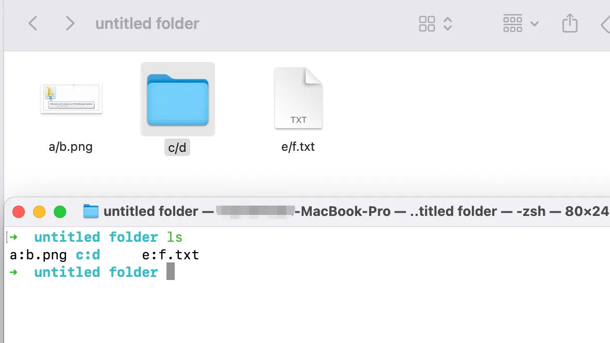
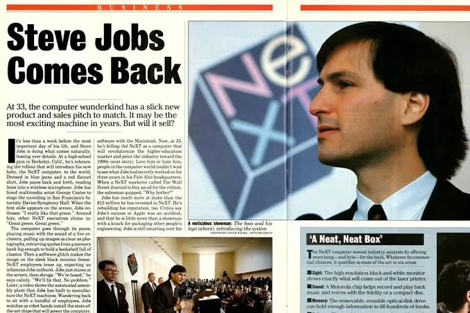
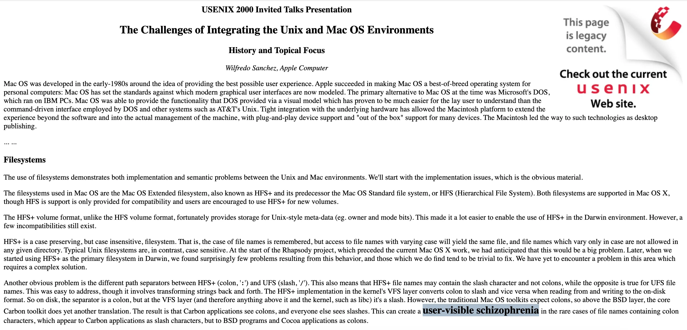

# 刚知道，在苹果操作系统里文件名竟然可以包含/

常年使用 Windows 的经验教会我一件事：**文件名里不能包含**`/`。这条直觉也被带进了 Linux，也带进了苹果操作系统。


直到最近，我在 macOS 的 Finder（访达）里随手测试了一下，看看文件名里到底能否包含 `/`。先是把一个图片文件重命名为 `a/b.png`，然后又新建了个叫 `c/d` 的目录，居然都成功了。

但打开终端，`ls` 一下，诡异的一幕出现了：

```bash
$ ls
a:b.png  c:d
```

斜线 `/` 怎么都变成冒号 `:` 了？

我又试着在终端里新建文件 `e/f.txt`：

```bash
$ touch e/f.txt
touch: e/f.txt: No such file or directory
```

失败了。但只要把名字改成 `e:f.txt`：

```bash
$ touch e:f.txt
```

就又能成功了。

再切回 Finder，`e:f.txt` 变成了一个名为 `e/f.txt` 的文件。冒号 `:` 又变回斜线 `/` 了。



## “用户可见的精神分裂”

这既不是 Finder 的 bug，也不是终端在抽风，而是一个“翻译层”，一个就连苹果自己的工程师都忍不住称之为“**用户可见的精神分裂**”（user-visible schizophrenia）的存在，一块不得已而为之的补丁。

让我们乘坐时光机器回到 **1985 年**。

彼时苹果推出了 **HFS**，即层次文件系统（Hierarchical File System），以取代最初只支持平铺目录的上一代文件系统。设计 HFS 时，工程师们需要选定一个路径分隔符（目录分隔符），他们最终选了冒号 `:`。

理由很简单，`:` 在文件名里不如 `/` 常用。`/` 有“或者”的意思，用户可能希望创建名称类似 `To_Be/Not_To_Be` 的文件。也就是说，在 HFS 的世界里，`:` 是“特殊字符”，`/` 是可以自由出现在文件名中的普通字符。

而远在 4000 多公里以外的贝尔实验室里，**Unix** 自 20 世纪 70 年代便确立了以 `/` 作为路径分隔符的传统，`:` 在 Unix 上只不过是个普通字符。

就在这一年，史蒂夫·乔布斯与董事会决裂后离开苹果，创立了 **NeXT 公司**。几年后，NeXT 推出了基于 **BSD Unix** 的操作系统 **NeXTSTEP**，其文件系统遵循 Unix 的规范，以 `/` 作为路径分隔符。

当时可能没人会想到，这套原本为 NeXT 电脑打造的类 Unix 系统，会在 10 年后随着乔布斯的回归，彻底改变苹果的命运。



命运的转折很快到来。1996 年，苹果在产品线和操作系统方向上深陷困境，收购 Be Inc. 的谈判在最后关头因价格分歧破裂。这一年 12 月，苹果宣布以约 4 亿美元收购 NeXT，**乔布斯王者归来**。

这笔收购的完结，意味着**两套截然相反的路径写法**不得不谋求共存。在基于 Unix 的操作系统底层，`/` 是路径分隔符，`:` 可自由出现在文件名中；但到了普通用户接触的表层，刚好相反，`/` 成了文件名中的普通字符。

工程师们给出的解决方案是，**在表层和底层之间加入一个翻译层**，文件跨层移动时，将 `/` 和 `:` 互换。这个方案看似简洁，但代价却是巨大的，制造了永久的“双重身份”——同一个文件，在 Finder 里叫 `a/b`，在终端里叫 `a:b`。



在 **2000 年 USENIX 年度技术大会**上，苹果的工程师在论文《The Challenges of Integrating the Unix and Mac OS Environments》中，把这个状态称为“**用户可见的精神分裂**”。能让自家员工在正式学术论文里吐槽，这个设计有多别扭，也就无需多言了吧。
