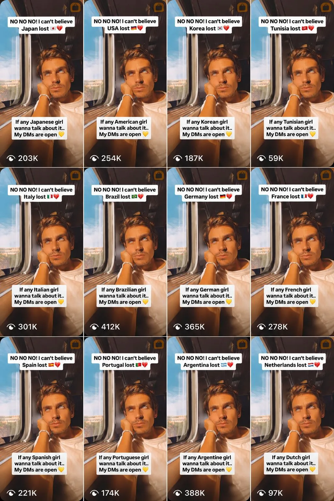

# 世界杯刚一输球，AI就开始“安慰”起女球迷，结果却不是为了跨国恋

“真不敢相信 {COUNTRY} 竟然输了！如果有任何 {COUNTRY} 女孩需要一点安慰……我的私信永远为你敞开。”

你以为这条简陋的文案，只不过是某个压抑已久的油腻大叔在网络上的搭讪？

其实这是创业者 Ben Guez 分享的一个案例。他展示了如何借助 AI Agent，将**热点事件监测、内容生成、精准投放、产品获客**串联成一条全自动的用户增长流水线。

Guez 搭建的这条流水线，锁定了世界杯赛后短暂而强烈的情绪窗口。他利用 **OpenClaw** 实时监测世界杯赛程和比分，一旦某支球队输球，便立刻按预设模板生成对应国家的视频，然后自动调用 Instagram 的发布接口完成上传，全程无需人工介入。

“如果需要一点安慰……我的私信永远为你敞开”，不仅文案套路简单粗暴，就连视频素材也是一成不变。无论是“安慰”哪个国家的女球迷，始终都是同一段：Guez 坐在火车窗边、望着窗外、一脸失落的画面。

十几个国家，十几条几乎一模一样的视频，就这样批量生产出来。

不过，Guez 巧妙地利用了 Instagram 的 **Trial Reels**（测试视频）功能。Instagram 推出 Trial Reels 本意是给创作者一个“投石问路”的机会，这类视频会优先推送给非粉丝群体进行效果测试，而且不会出现在创作者的主页上。

Trial Reels 的正确用法是先在陌生用户那里测试效果，如果反响不错，再一键分享给粉丝。而 Guez 却反向利用了这个功能，既利用算法把每条视频精准推送给对应国家的用户，又避免他们进入主页，看到这些批量生成的模板化内容，让各国的女球迷都误以为这是专门拍给自己的。

几天内，这套系统累计拿下超过 **100 万次播放**，收到 **200 多条主动私信**。但 Guez 的目标当然不是“趁人之危”发展一段异地恋。他的 Instagram 简介只写了一句话：

> I only answer DMs sent via Canary.（我只回复通过 Canary 发来的私信。）

Canary，正是他自己开发的一款 AI 语言学习应用。

于是整条链路完整闭合：世界杯热点事件 → AI 自动生成内容 → Instagram 精准推荐 → 用户产生兴趣 → 点击主页 → 下载 Canary → 通过 Canary 联系作者！

留下了不甘泪水的女球迷，最终沉淀成了潜在用户。
