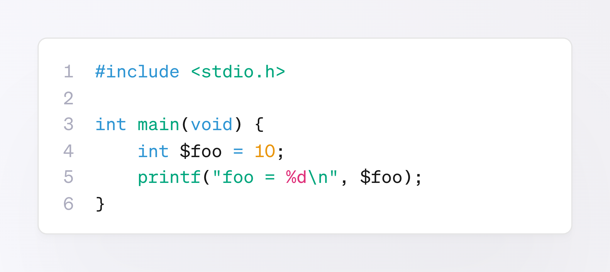
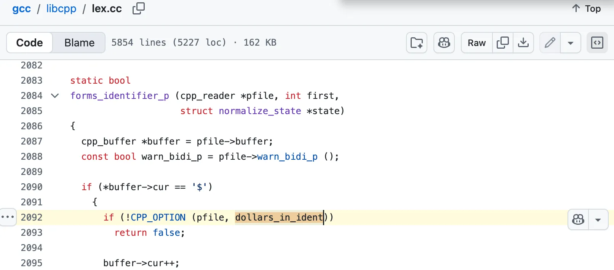

# PHP程序员也没想到吧？C语言的变量名，也能用$开头

在 PHP 程序员眼里，`$` 似乎是这门语言独有的标记，因为变量名必须以 `$` 开头。

而刚迈入大学校门的新生，捧着谭浩强老师的教材，把 C 语言当成第一门编程语言，大概在第一课就会被告知：变量名（标识符）里只能包含字母、数字和下划线。

可事实是，下面这段 C 语言代码“**大概率**”能顺利通过编译：



```c
#include <stdio.h>

int main(void) {
    int $foo = 10;
    printf("foo = %d\n", $foo);
}
```

用 `gcc dollar.c` 编译，过程干净利落，没有一行警告，程序照常输出 `foo = 10`。这说明 `$foo` 是一个完全有效的标识符，`$` 出现在开头也毫无问题。

为什么说“大概率能顺利通过编译”呢？因为这里用的是 GCC（**G**NU **C**ompiler **C**ollection，Linux 世界的默认编译器），而 GCC 支持一个由 `-fdollars-in-identifiers` 选项控制的特性，控制 `$` **能否出现在标识符中**。默认情况下这个选项是打开的，于是，`$` 不仅可以像 `$foo = 10;` 这样出现在标识符开头，还能出现在任意位置。

但只要编译时加上 `-fno-dollars-in-identifiers` ，关掉这个选项，一切就会打回教材里标准 C 该有的样子——编译器会毫不留情地对 `$foo` 抛出 `error: stray ‘$’ in program` 的错误。

C 语言标准委员会当年划定，标识符只能包含字母、数字和下划线，但 GCC 从一开始的定位，就**不只是“一个符合 ISO 标准 C 的编译器”**，而是要伺候整条 Unix / GNU 工具链。

在汇编器和链接器的世界里，`foo$bar` 这样的符号并不罕见，链接阶段生成的内部符号也常常带着 `$`。如果 C 代码需要直接访问这类底层符号（比如 `extern int foo$bar;`），前提就是**词法分析器得先认得** `$` 这个字符。于是 GCC 索性把这道门槛拆掉，把 `$` 开放给了普通用户。

在 GCC 的源代码里可以看到，词法分析器会逐字符往前推进，一旦碰到 `$`，就去查 `dollars_in_ident` 这个标志位：为真，就把 `$` 并入正在构建的标识符；为假，`$` 就被当成一个不认识的字符，直接 `return false`，进而报错。



顺带一提，PHP 变量名开头的 `$`（也有人认为 `$` 不算变量名本身的一部分吧）在编程语言里还有个专门的名字，叫 **sigil**——原意是巫术里附着法力的“符印”。

Perl 之父 Larry Wall 借来指代那些贴在变量名前、用来标出其类型或作用域的符号。Perl 里 `$scalar`、`@array`、`%hash` 用不同的 sigil 区分不同的数据结构，PHP 则继承了这一套，所有变量前一律加 `$`。

🔚