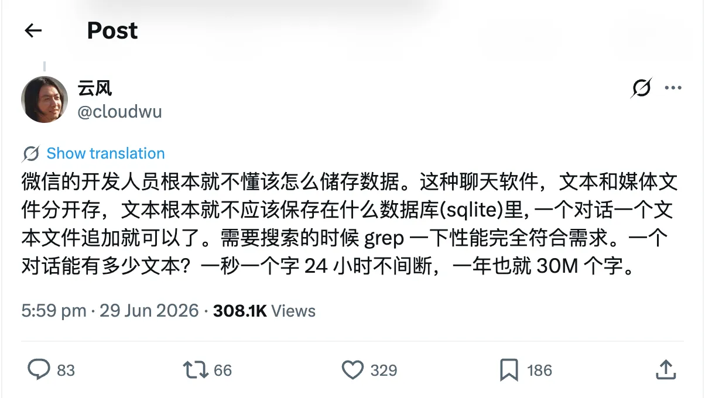
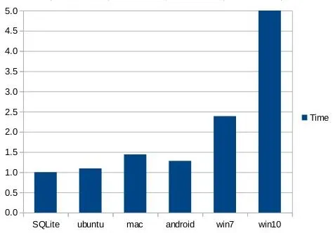
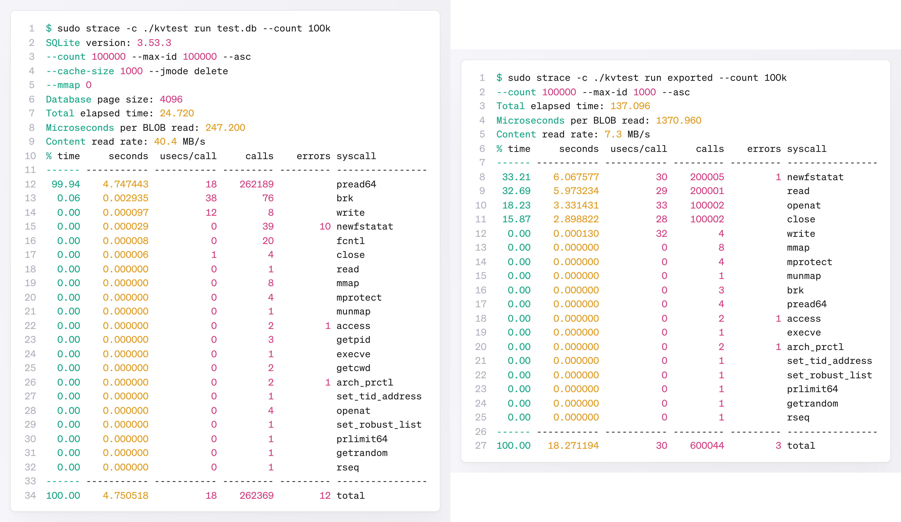
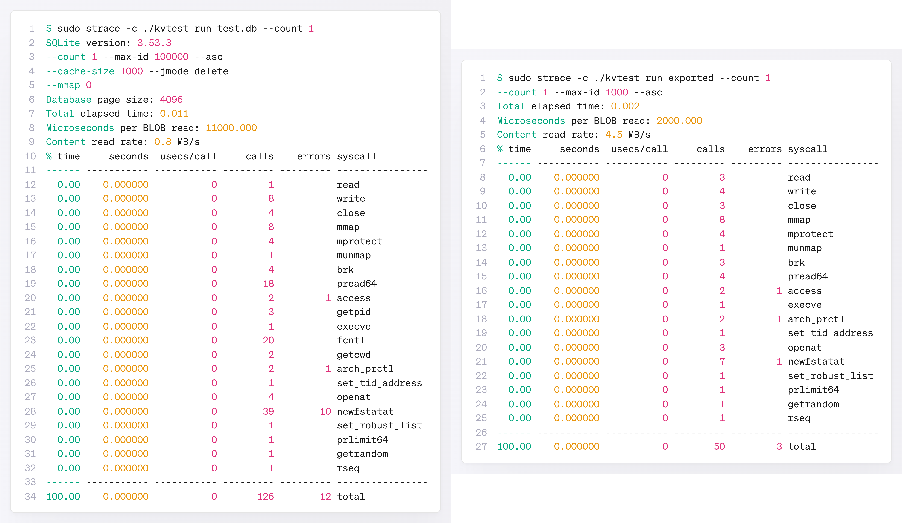

# 微信到底该不该用SQLite？有时候访问数据库反倒比读写文件更快？

最近，一场关于**微信应该如何存储聊天消息**的争论，在开发者圈子里引发了热议。

先是前网易引擎架构师云风（@cloudwu）揶揄道：

> “微信的开发人员根本就不懂该怎么存储数据。……文本根本就不应该保存在什么数据库（sqlite）里，一个对话一个文本文件追加就可以了……”

随后，据说有开发者翻出了技术细节：“聊天记录中的每条消息都是用 zstd 压缩后，再存入 SQLite 的……**一个为关系型查询优化的数据库引擎，被当作压缩版 BLOB 的容器**……”。（暂时没有找到这条评论的原始出处）

**BLOB**（Binary Large Object），即**二进制大对象**，是一种数据库字段类型，通常用于存储图片、音视频等大容量二进制数据。虽然数据库支持这样一种数据类型，但在实际项目中，几乎没有人会不顾 DBA 同学的白眼使用 BLOB 字段。通常是将文件存储到磁盘或对象存储中，数据库中只保留路径。

这样做的原因似乎显而易见：文件系统离磁盘更近，只需 `open()`、`read()`、`write()` 等几个系统调用就能直达磁盘；而数据库需要经过 SQL 解析、B-tree、事务日志等多层处理，路径更长，开销自然更高。

但 SQLite 官方的一篇文章《35% Faster Than The Filesystem》给出的实测**结果恰好相反**。

根据文中的描述，使用 SQLite 自带的 `kvtest` 性能测试工具，生成 10 万个 8KB～12KB 的随机 BLOB，分别以独立文件和数据库表记录的形式存储，再进行反复读取测试。结果显示，**使用 SQLite，读取速度提升了 30%以上，同时还能节省约 20%的存储空间**。

核心原因在于，访问 10 万个独立文件，就意味着需要执行 10 万次 `open()` 和 `close()` 系统调用；而访问数据库中的这些记录，通常只需要维护一次数据库连接，从而避免了大量单次文件打开和关闭带来的开销。

`open()` 背后需要经历路径解析、权限检查、inode 查找等一系列操作，而这些开销与文件大小基本无关。因此，**访问的文件越少，这部分“固定成本”占总耗时的比例就越高**。

该用文件还是该用 SQLite？这场争论的核心或许很大程度上是一个统计问题，而不是非黑即白的结论。

如果只读取 1 次 BLOB，那么 SQLite 不但没有明显优势，还会产生 SQL 解析、B-tree 定位等额外开销，未必比一次 `open()`+`read()` 更高效。SQLite 真正的优势，在于它能够把与文件大小无关的、“打开文件”这种固定成本，均摊到成千上万次访问中。

 SQLite 自带的 `kvtest` 工具之所以能测出约 35%的性能提升，正是因为它设计了 10 万次读取操作——这是**一个刻意放大“摊销效应”的测试场景**。从下面使用 `strace` 命令统计系统调用执行次数和耗时的对比数据中，可以更直观地说明这一点。

---

早在 2006 年，图灵奖得主 Jim Gray 就研究过这个问题。他在微软研究院发表的《To BLOB or Not To BLOB》中指出，BLOB 存储位置并没有绝对答案，关键取决于访问模式：读写比例、更新频率，以及对象生命周期中的访问次数。小对象通常能从数据库管理受益，而大对象通常更适合文件系统；真正决定性能的，是这些对象会被怎样使用。

也许，比起争论“能不能用 SQLite”，更应该先问：数据属于哪一种读写模式？

🔚