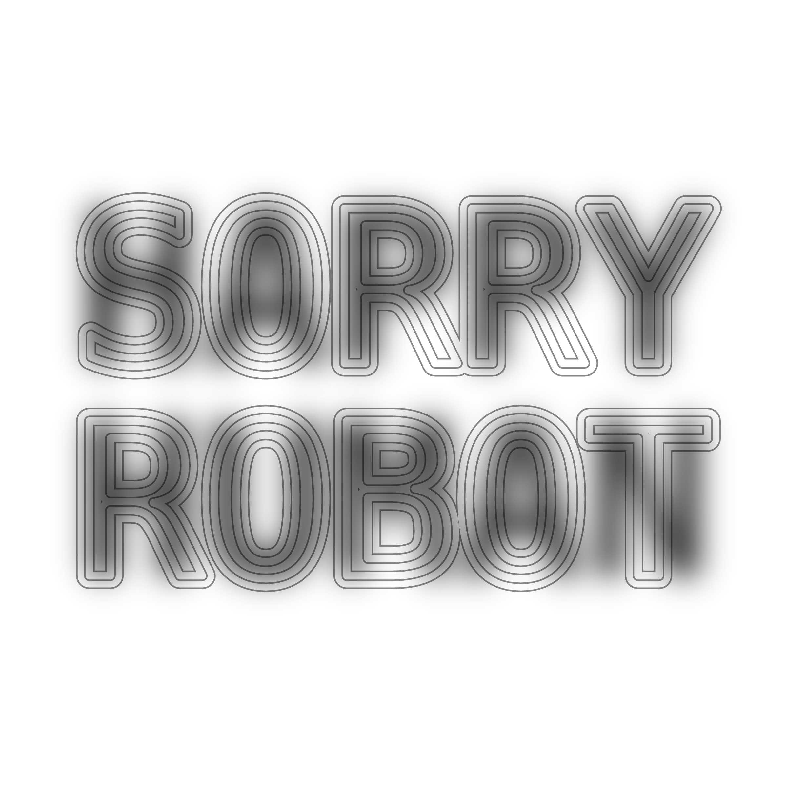
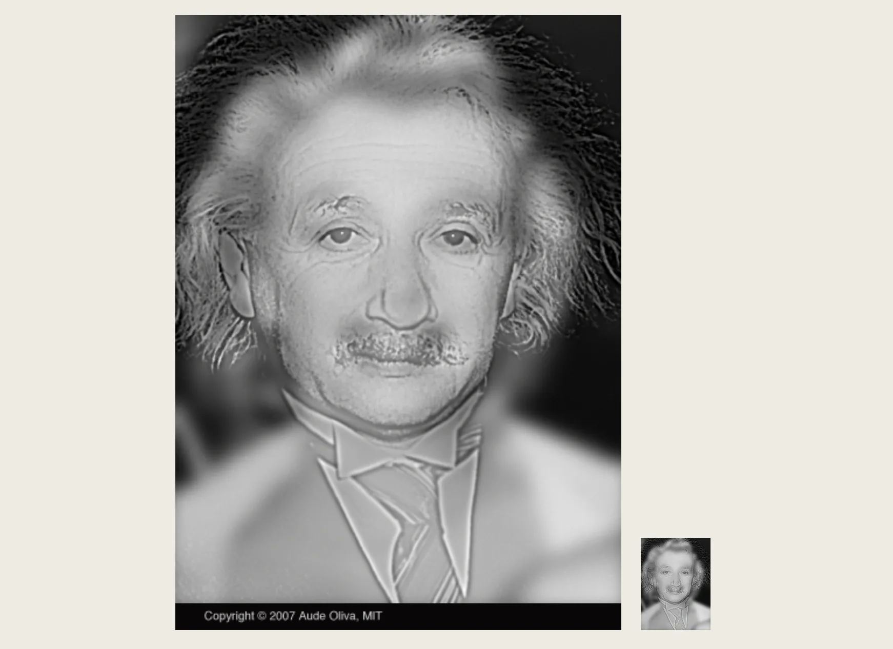
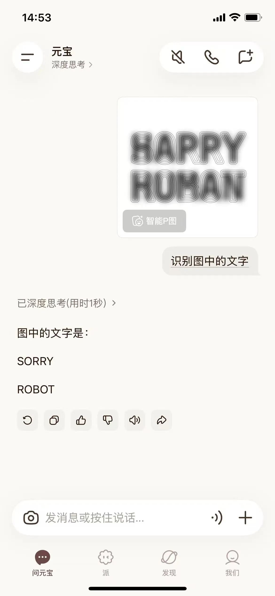

# Decoy Font：一款专门“欺骗”AI的字体

如今，AI 越来越擅长“读图”，图片里的文字几乎难逃 OCR 和视觉大模型的“慧眼”。如何确保人类能够正常阅读，同时又阻止 AI 识别，甚至误导 AI，让其**识别出预先设计好的“诱饵信息”**，正成为一个新的研究方向。

最近，**一款名为 Decoy Font 的开源字体**，就用一种颇具创意的方式回答了这个问题。

图中的单词是什么？是 SORRY ROBOT，还是 HAPPY HUMAN？

把手机再贴近点看看，或是眯起眼睛再看一次，有没有发现变化？

这就是 Decoy Font 的神奇之处：同一段“文字”可以同时承载两条完全不同的信息。它不依赖加密或文本混淆，而是利用人眼与 AI 在视觉处理机制上的差异，让 AI “看到”截然不同的内容。

一个类似的经典案例，是那张近看是爱因斯坦、远看却变成玛丽莲·梦露的视觉错觉图片。其原理是将不同空间频率的信息叠加在同一张图上，人眼会根据观察距离，自动侧重不同的频率成分。

Decoy Font 把这一思路搬进了字体设计。每个字符实际上由两层信息叠加而成：

- **高频信息**：细线条勾勒出的字符轮廓，组成诱饵（decoy）文本以欺骗 AI；
- **低频信息**：模糊的背景色块，组成真正希望人类读到的内容。

对人类来说，眯起眼睛便能看到需要传达的真实内容；而许多 AI 视觉模型在识别时，却更容易读出“诱饵文本”（decoy message）。Decoy Font 借此达到干扰 OCR 识别或 AI 抓取的目的。

目前，多数视觉大模型和 OCR 系统主要依赖局部纹理、边缘和清晰轮廓来完成文字识别，因此更容易被高频轮廓信息主导，而忽略人眼才能还原出的文字。

简而言之，人和 AI 看到的，并不是同一段文字。

当然，这并不意味着 AI 永远无法破解。开发者也指出，这更像是一种视觉层面的对抗手段，而非真正意义上的加密。如果 AI 在识别前加入模糊处理、多尺度分析，或经过专门的 Prompt 引导，未来仍有可能还原出被隐藏的信息。

虽然还算不上一种可靠的安全方案，但 Decoy Font 已经展示出不少有趣的应用场景：

- 干扰 OCR 对敏感信息的自动识别；
- 设计新型验证码（CAPTCHA）；
- 制作只有人类才容易读懂的趣味“密语”

Decoy Font 的作者还表示，未来计划将这一技术扩展到中文等更多语言。相比拉丁字母，汉字拥有更复杂的笔画结构和更统一的字形尺寸，这为不同空间频率信息的叠加提供了更大的设计空间。理论上，这类技术用在中文字体上的隐藏效果，很可能优于英文。
