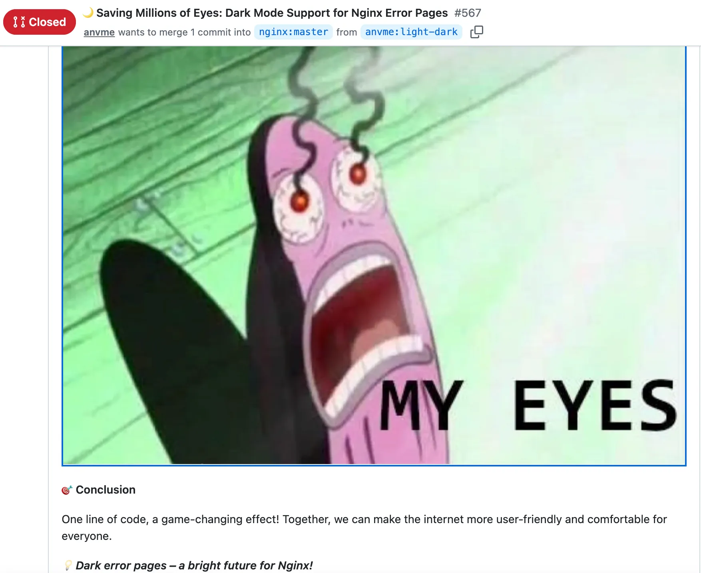
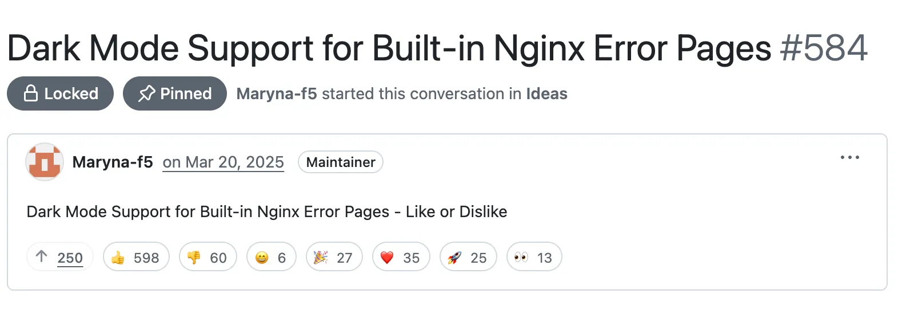
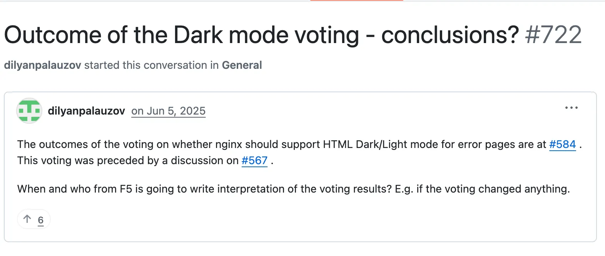
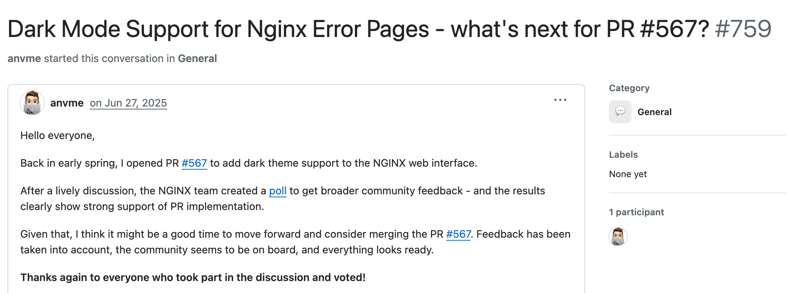

#  就一行HTML代码，Nginx社区拖了一年多

日常工作里，因为一个微不足道的需求跟对方扯皮半天，这种事大概谁都遇到过。但你可能没想到，开源社区也一样。

Nginx 的错误页面，就为了**要不要支持深色模式，已经争论了一年多**。事情其实很简单。

2025 年 3 月，一位开发者给 Nginx 提交了一个补丁，标题挺幽默：**"🌙 Saving Millions of Eyes: Dark Mode Support for Nginx Error Pages"**——拯救数百万双眼睛，给 Nginx 错误页面加上深色模式。PR 描述里还有一句更妙的双关：**💡 Dark error pages – a bright future for Nginx!**——黑暗的错误页面通向 Nginx 光明的未来。



深色模式改起来并不复杂，只要在 HTML 里加一行：

```html
<meta name="color-scheme" content="light dark">
```

相当于告诉浏览器：这个页面同时支持浅色和深色模式，你看着办。

提交者给出的理由也很充分：减少夜间浏览时的眼部疲劳、OLED 屏幕更省电、遵循现代 Web 标准。更何况 Nginx 支撑着全球超过 30% 的网站，影响面巨大。

但这个补丁很快被拒绝了。3 月 17 日，维护者关闭了 PR，理由很直接：Nginx 的默认错误页面应该保持简单，这一行标签是多余的。如果用户不喜欢白色的默认页面，可以通过 `error_page` 自定义。

这下事情更热闹了。Nginx 背后的运营公司 F5 在 3 月 20 日发起了一次公开投票，询问大家是否希望支持深色模式。结果：**598 个赞，60 个踩**。超过 90%的投票选择深色模式，几乎是一边倒地支持。



但投票并没有改变什么。两个半月后，也就是 6 月 5 日，有人忍不住开始追问：投票之后有结论了吗？



没有回应。零条回复。三周后，6 月 27 日，最初提交 PR 的那位开发者又开了一个 Discussion 再次询问：深色模式这事，下一步有什么打算？



还是没有回应。依然零条回复。

一年多过去了，仍然没有解决方案，也没有明确的答复。最初添加深色模式支持的 PR 仍然处于锁定状态。
