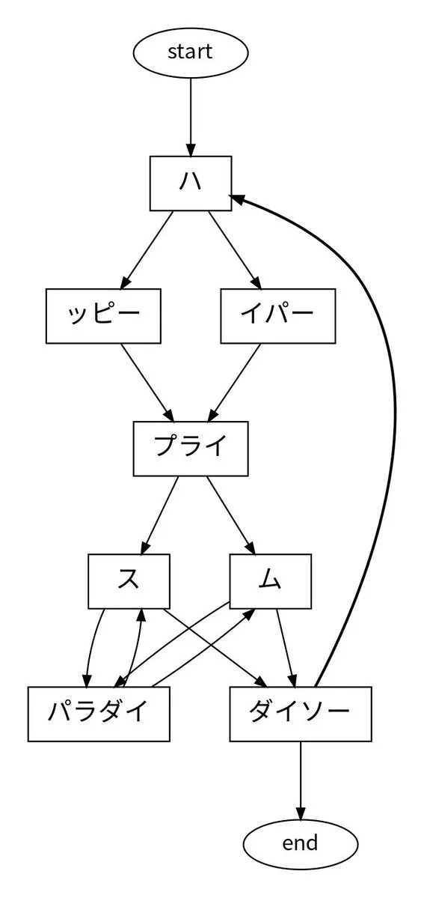
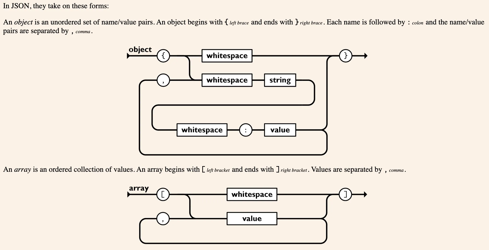

# 程序员如何记歌词：一行正则表达式装得下的歌词

日本大创（DAISO，类似国内的 MINISO·名创优品）的店内背景音乐叫《HAPPY PRICE PARADISE -あるお店の物語-》，2020 年开始循环播放至今。

这首歌的歌词总共只有 6 个英文单词，分成 3 组，每一组的单词都发音相似（应该只是对日本人来说才相似吧）：

- happy / hyper
- price / prime
- paradise / paradigm

每句都是 3 个单词，乍一听是同一句话反复在唱，仔细听才会发现，每一段的词都不太一样，非常洗脑。据说有人进店本来要买东西，听着听着，就忘了自己要买什么。

每句歌词有 3 个槽位，每个槽位有 2 个可选单词。所以那句听上去一模一样的“口号”，实际是以下 6 句中的某一句：

- happy price paradise
- hyper price paradise
- happy prime paradise
- happy price paradigm
- hyper prime paradigm

可能没想到吧，这首歌的歌词其实**一行正则表达式就能装下**：

`/h(appy|yper) pri(ce|me) paradi(se|gm)/`

考虑到日式英语的发音，有网友写出了用日文片假名模拟英文发音的正则表达式：

`(ハ(ッピ|イパ)ープライ[スム]パラダイ[スム](ダイソー)?)+`

- happy → ハッピー
- hyper → ハイパー
- price → プライス
- prime → プライム
- paradise → パラダイス
- paradigm → パラダイム

可以看出，price 和 prime 只差一个结尾音（プライ**ス** / プライ**ム**），paradise 和 paradigm 同理（パラダイ**ス** / パラダイ**ム**）。这里还考虑到结尾处的口号“DAISO”（ダイソー）不是每一句都有，用了正则表达式中的 `?`这个可选的匹配。

还有网友把这首歌的歌词画成了 UML 状态图，复用了**ス**/**ム**两个片假名对应的状态：

其实，用图去记录一首歌的歌词，早已有之。《Hey Jude》就被画成过一张著名的“流程图”，甚至还印到了衣服上。

《Hey Jude》“流程图”的专业叫法应该是**铁道图**（railroad diagram，正名 syntax diagram）——线路像铁轨一样铺开，分岔是可选项，回环是重复，能从入口一路走到出口的路径，就是合乎语法的句子。

最有名的一组铁道图，就挂在 json.org 上。Douglas Crockford 2001 年定义 JSON 时，用铁道图直观呈现了 JSON 的语法。

